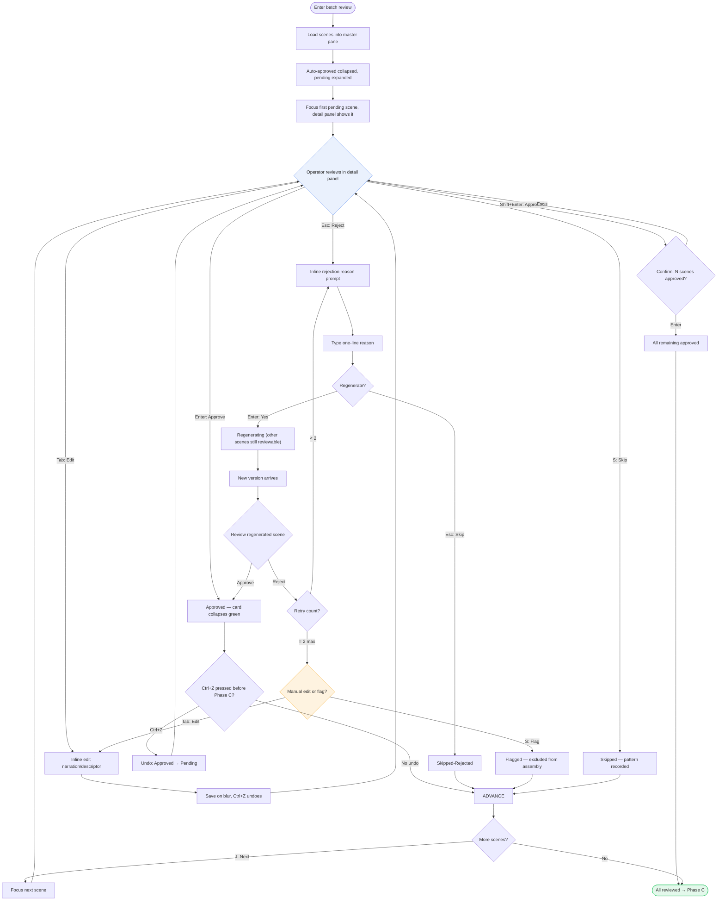
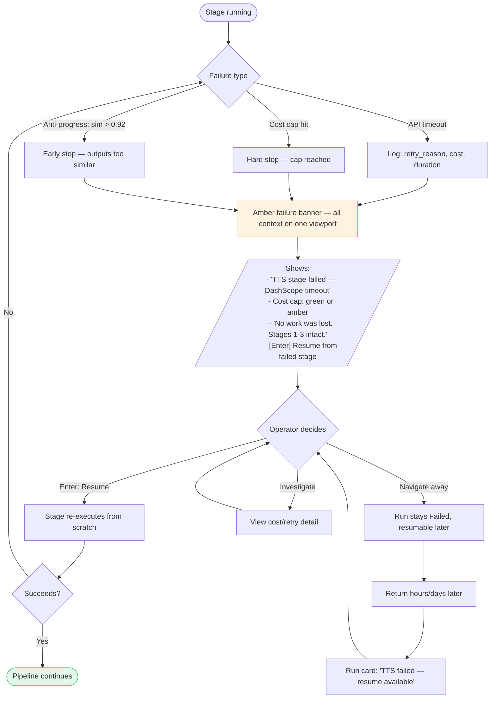
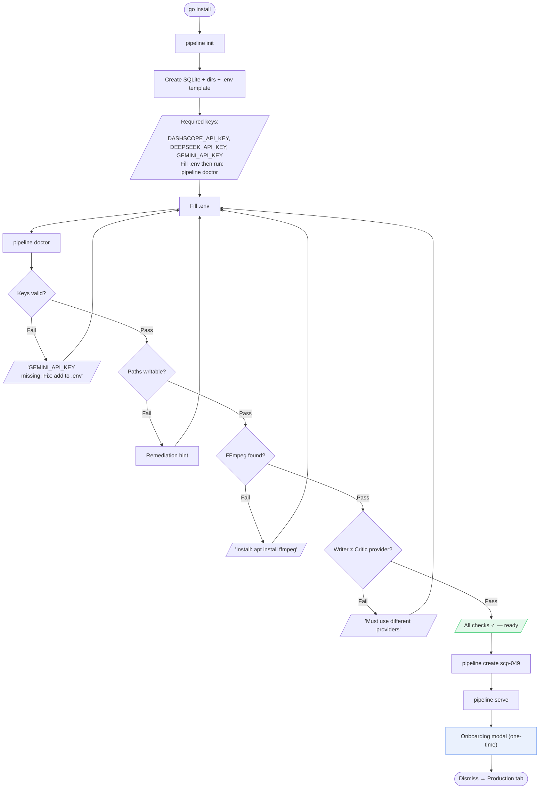
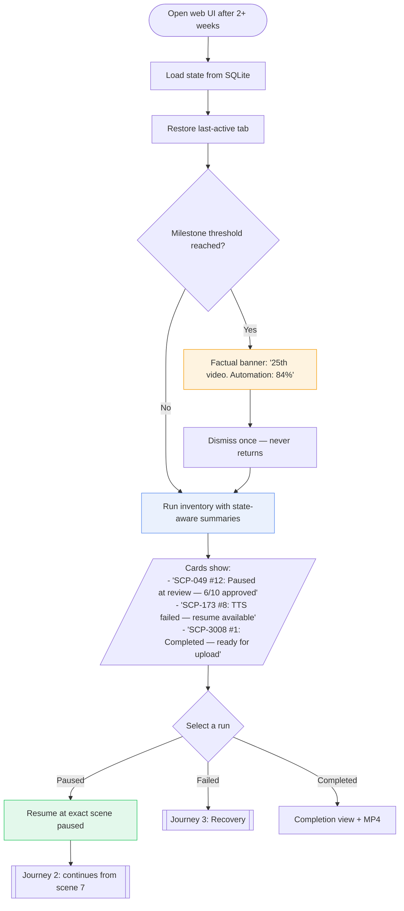
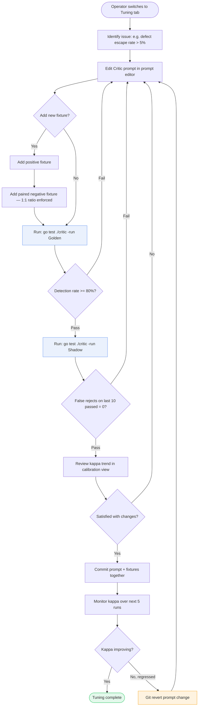

---
stepsCompleted:
  - step-01-init
  - step-02-discovery
  - step-03-core-experience
  - step-04-emotional-response
  - step-05-inspiration
  - step-06-design-system
  - step-07-defining-experience
  - step-08-visual-foundation
  - step-09-design-directions
  - step-10-user-journeys
  - step-11-component-strategy
  - step-12-ux-patterns
  - step-13-responsive-accessibility
  - step-14-complete
completedAt: 2026-04-14
lastStep: 14
inputDocuments:
  - _bmad-output/planning-artifacts/prd.md
  - docs/analysis/scp.yt.channels.analysis.md
  - docs/ui.examples/dashboard.png
  - docs/ui.examples/pipe.png
  - docs/ui.examples/scenes.png
project_name: youtube.pipeline
user_name: Jay
date: 2026-04-13
partyModeInsights:
  rounds: 3
  agents: ["Sally (UX)", "John (PM)", "Winston (Architect)", "Mary (Analyst)", "Murat (TEA)", "Paige (Tech Writer)", "Amelia (Developer)"]
  outcome: >
    R1: decisions history re-framing (trust anchor → Timeline V1 + Patterns V1.5),
    Failure UX promoted to principle, 9→4 surface compression, post-publish gap identified,
    Vision Descriptor diff-edit failure mode surfaced, marketing language purged.
    R2: Slot+Strategy architecture validated (Winston), test cost 9 auto cases (Murat),
    schema hook V1 + API V1.5 (Winston+Murat), passive capture principle (Sally+Mary).
    R3: 3-not-4 surfaces fix (Paige), V1 non-negotiables (John), principle hierarchy (Sally),
    diff-edit → plain pre-fill V1 / semantic V1.5 (Amelia), glossary added (Paige).
---

# UX Design Specification — youtube.pipeline

**Author:** Jay
**Date:** 2026-04-13

---

## Executive Summary

### Project Vision

`youtube.pipeline` is a single-operator production workstation that
turns an SCP Foundation article ID into a publishable Korean-language
horror YouTube video through an 80% automated / 20% human-in-the-loop
pipeline. The UX success contract is operational, not aesthetic:
**the tool is still the operator's primary production path at Month
6**, with automation rate >= 80%, critic calibration kappa >= 0.7,
and defect escape rate <= 5% (rolling 25-run window, per PRD
SS.Success Criteria).

The reference axis is **solo-operator decision velocity x error
recovery cost** — single-viewport state visibility with zero
collaboration overhead. The single governing directive: **the 20%
manual contribution must become the most *creative* 20%, not the
most repetitive.** Wear-pattern UX (first-video legibility ->
thirtieth-video muscle memory) is therefore a first-class
requirement.

**V1 UX non-negotiables:**

- (a) **Trust calibration** — AI judgment rationale (Critic score +
  sub-scores) exposed inline on every scene-bearing surface, so the
  operator reads trust context passively. *Traces to: FR24, FR29,
  NFR-A1.*
- (b) **Failure recovery** — from any failed state, the operator
  reaches a successful `resume` in <= 3 clicks with cost-cap
  telemetry visible on the same viewport. *Traces to: FR2, FR5,
  NFR-R1.*
- (c) **Returning-user resume** — the last interaction point is
  auto-restored on re-entry; no "where was I?" friction after a
  multi-week gap. *Traces to: FR49, FR50.*
- (d) **Keyboard-first interaction** — the eight-key shortcut set
  drives all primary HITL actions. *Traces to: NFR-A1.*
- (e) **Stage stepper** — six-stage progress indicator present on
  every run-bearing surface. *Traces to: FR4, FR5.*

### Target Users

A single operator — Jay — across **nine cognitive modes** that map
onto **three UI surfaces (SPA routes) plus one onboarding modal**.
PRD's three tabs are realized as `/production`, `/tuning`, and
`/settings`. Cognitive modes are a framing device for where design
attention goes; they are **not** a count of screens to build. The
design unit is **Tab x State**, rendered via a Slot + Strategy
composition pattern (each surface provides a fixed layout shell —
header, content slot, action bar — while mode-specific logic is
injected into the content slot as an independent component, selected
by the service layer's `PipelineState` enum).

**Cognitive modes (for design reasoning only):**

- *Production surface* (`/production`) — Produce (happy path),
  30th-Repeat (wear pattern), Recover (stage-level failure), Return
  (2-week gap).
- *Tuning surface* (`/tuning`) — Critic-tune (prompt + Golden/Shadow
  eval), Golden-curate (fixture authoring).
- *Diagnostician / Reviewer* — cost anomaly investigation (Mode 4),
  Day-90 gate evaluation (Mode 5); served by read-only panels inside
  Production and Tuning surfaces plus CLI (`pipeline metrics
  --window 25`). Not independent routes.
- *First-setup* — onboarding modal triggered on empty-state
  detection at any route entry.

Desktop-only, localhost-only (`127.0.0.1`), latest Chrome / Firefox /
Safari. No mobile, no tablet, no external network.

### Core Design Principles

Four principles govern every surface. When principles conflict, the
**hierarchy** (highest wins) is:

> **Failure UX > Content Area > Context Switching > Passive Capture**

Example: a failure banner (Principle 1) may temporarily push content
below the 70% threshold (Principle 3); this is correct behavior.

1. **Failure UX without panic.** Stage-failed banner, cost-cap
   status (NFR-C1), and one-click `resume` affordance (FR2) are
   co-present on a single viewport. Failure context never requires
   a second click. Testable: from a failed run state, the operator
   reaches a successful `resume` attempt in <= 3 clicks; cost-cap
   telemetry is visible on the same viewport as the failure banner.
2. **Content area >= 70% of viewport** on every production-facing
   surface (scene card, character-reference grid, precision-review
   pane). Controls and chrome share the remaining 30% via
   progressive disclosure — only controls relevant to the current
   pipeline state are visible; the rest are collapsed. *Traces to:
   FR31a-c, FR32.*
3. **Context switching is designed, not assumed.** Each tab entry
   shows a one-line continuity banner ("Run #12, Scene 4/8 awaiting
   your review") so mode transitions carry their own context
   forward. Prevents the "where was I?" restart on every switch.
   *Traces to: FR49, FR50.*
4. **Passive capture — Jay records, the system curates.** The
   operator's job is to make decisions; structuring those decisions
   (snapshot, linkage, tags) is the system's job. No explicit
   "organize your decisions" task ever appears in any surface.
   V1 `decisions` table ships with:
   - `context_snapshot` (JSON) — auto-captured alternatives
     presented and choice made at each HITL checkpoint.
   - `outcome_link` (nullable FK) — links the decision to the
     resulting output scene/segment.
   - `tags` (TEXT, auto-generated) — rule-based decision-type
     classification (tone, visual, hook, pacing).
   The Patterns view that aggregates these fields is V1.5.
   *Traces to: FR36, FR37.*

### Design Direction

- **Tone**: single-seat creative workstation; content-first layouts
  with generous whitespace; UI chrome recedes. Marketing phrasing
  ("studio-grade", "signature moment", "emotional contract") is
  deliberately avoided — each claim is re-expressed as a layout or
  metric constraint in Principles and Challenges.
- **Density**: *spacious* default on Production (one run, one
  decision in focus); *compact* permitted only on Tuning where data
  density is intrinsic to the task (properties-panel idiom).
- **Motion**: moderate. Meaningful state transitions on stage
  progression, HITL approvals, and character-pick confirmation.
  Optimistic-UI feedback < 100 ms at keypress; all other transitions
  150-250 ms. Ctrl+Z undo response is the non-negotiable floor
  (NFR-A1).
- **Color**: dark mode (primary); blue as the main accent family.
  Genre-specific theming (horror / cinematic) belongs to the output
  content, not the workstation surface — prevents operational
  fatigue.
- **Input model**: keyboard-first. The eight-key shortcut set
  (Enter / Esc / Ctrl+Z / Shift+Enter / Tab / S / 1-9 / J/K)
  is a brand affordance; hints persistently visible without hover
  (NFR-A1).

### Key Design Challenges

Challenges are design problems whose solution remains to be detailed
in subsequent steps. Each is phrased with a measurable closure
target.

1. **Wear-pattern degradation across 6+ months.** Surfaces must
   degrade gracefully from first-time legibility to thirtieth-video
   muscle memory. Novelty affordances (prominent onboarding
   tooltips, celebratory animations on routine events) are anti-
   patterns. Measurable: operator-attended time on run N <= 60% of
   run 1 on comparable SCP class by N = 10 (instrumented via
   stage-timestamp telemetry from Day 1; formal gate from V1.5).
   *Traces to: PRD SS.Success Criteria "time leverage".*
2. **Trust calibration across HITL tiers.** If the operator loses
   trust in the auto-approve tier once, the 80% automation promise
   collapses. Critic score must appear as an ambient visual token
   (bar + score + state color) on every scene-bearing surface.
   Measurable: operator override rate on auto-approved items
   <= 5% (rolling 25-run window; instrumented Day 1, formal gate
   when n >= 50). Note: this is distinct from the PRD's defect
   escape rate (<= 5%), which measures Critic misses rather than
   operator trust. *Traces to: FR24, FR29, FR31a.*
3. **Precision review as multi-sense comparison.** Image + Korean
   narration text + audio playback must be fluently comparable on
   one viewport — not sequential tab-hopping. Measurable: from
   precision-review entry to decision, <= 3 clicks; audio and image
   are visible simultaneously without scrolling at a 1440px-wide
   viewport baseline. *Traces to: FR31b, FR31c, FR32.*
4. **Returning-user session continuity (2-week gap).** Each run card
   auto-generates a one-line "what was happening" summary from the
   latest `decisions` row + stage status. Paused precision-review
   touchpoints resume at the exact decision frame. Verification:
   fixture-seeded (test DB snapshot, not Golden eval fixtures)
   manual QA checklist each sprint; 5-step resume test <= 15 min.
   *Traces to: FR49, FR50.*
5. **Creative-work degradation trap (Vision Descriptor failure
   mode).** Character-pick's 1-of-10 grid is creative; but the
   Vision Descriptor edit box becomes copy-paste labor by run 5
   unless the UI presents a pre-fill surface. V1 ships **plain text
   pre-fill** — previous descriptor loaded into the edit field for
   the operator to modify. V1.5 upgrades to **semantic diff-edit**
   (field-level comparison with highlighted novel segments editable
   in-place). Without at least the V1 pre-fill, "most creative 20%"
   silently inverts. *Traces to: FR17, FR18.*
6. **Post-publish feedback gap.** V1 currently has no path for
   viewer feedback (comments, retention data) to reach the Critic
   loop. Without external signal, the system learns only the
   operator's self-confirmation bias. V1 mitigation: `decisions`
   table ships with `feedback_source` (TEXT), `external_ref` (TEXT),
   `feedback_at` (TIMESTAMP) as nullable schema hooks for manual
   data entry. The CLI command `pipeline feedback import` and
   YouTube Data API automation are both **V1.5**. *Traces to: FR36
   (schema extensibility).*
7. **Observability visible, not buried.** The operator is their own
   diagnostician. `pipeline_runs` context (cost, retry reason,
   anti-progress telemetry) must be reachable via read-only panels
   inside Production and Tuning surfaces; raw SQL (`sqlite3`)
   remains a sanctioned escape hatch, not the primary diagnostic
   path. *Traces to: FR6, NFR-O1, NFR-O3.*

### Design Opportunities

Where good UX produces disproportionate leverage for this specific
operator.

1. **Keyboard-first as brand identity.** Every primary action is
   keyboard-reachable; shortcut hints persistently visible in a
   subtle, Linear-like inline label idiom. Pro-tool feel without
   hostility. *Traces to: NFR-A1.*
2. **Critic score as ambient UX currency.** A consistent visual
   token (color-coded bar + numeric score + pass/retry/fail state
   badge) on every scene card across batch and precision surfaces —
   trust read passively, not audited actively. *Traces to: FR24.*
3. **Character reference pick as a high-leverage creative surface.**
   The 1-of-10 candidate grid + Vision Descriptor pre-fill (V1:
   plain text; V1.5: semantic diff-edit) is the most creative 20%.
   Moderate motion peaks here — selection confirmation uses the
   upper bound of the 150-250 ms transition range with a subtle
   scale + fade. *Traces to: FR17, FR18.*
4. **Decisions as Timeline (V1) and Patterns (V1.5) on one table,
   two lenses.** V1 ships a Timeline view in Settings & History —
   a filterable list (by SCP ID, stage, decision type) for
   debugging and retrospective. V1.5 adds a Patterns view over the
   same rows via `tags` aggregation — auto-clustered insights
   (e.g. "Hook type: question-opening -> 78% approve") surfaced
   for confirmation with a Yes/No prompt, never a data-entry task.
   The V1 schema hook (`context_snapshot`, `outcome_link`, `tags`)
   makes this a query addition, not a migration. *Traces to: FR36,
   FR37.*
5. **Run inventory with state-aware summaries.** Each run card's
   one-line hook (generated from latest `decisions` row + stage
   status) makes the return experience first-class and the
   switch-tab orientation cheap (supports Principle 3). *Traces to:
   FR4, FR50.*
6. **Completion-moment reward.** The satisfaction budget lives at run
   completion: an output video preview (thumbnail + first 5s
   auto-play), metadata bundle status confirmation, and a
   next-action CTA ("Upload checklist" or "Start next SCP"). The
   six-stage stepper provides functional wayfinding throughout the
   run; the reward is concentrated at the finish line. *Traces to:
   FR20, FR23.*

### Glossary

| Term | Definition |
|---|---|
| Wear-pattern UX | Design that anticipates how a surface changes in perceived utility from first use to hundredth use; optimizes for the repeat-use end of the spectrum. |
| Golden eval set | A hand-curated set of >= 20 Critic test fixtures (positive:negative = 1:1) used as a regression gate for Critic prompt changes. |
| Shadow eval | A dry-run of a Critic prompt change against the 10 most recently passed scenes; any false-rejection blocks the change. |
| Critic calibration (kappa) | Cohen's kappa between Critic auto-verdicts and operator override decisions, measured on a rolling 25-run window. |
| Override rate | Fraction of auto-approved scenes that the operator subsequently rejects; measures operator trust in the auto-approve tier. Distinct from defect escape rate. |
| Defect escape rate | Fraction of Critic auto-passed scenes that the operator subsequently rejected; measures Critic accuracy. Distinct from override rate. |
| Slot + Strategy | A UI composition pattern where each surface (route) provides a fixed layout shell (header, content slot, action bar) and mode-specific content is injected into the slot by a strategy selected at runtime from the pipeline state enum. |
| HITL 3-tier | Three review intensities: auto-approve (Critic-score gated), batch review (bulk scene overview), precision review (extended detail for high-leverage scenes). |
| Confidence oscillation | The operator's trust in a pipeline run follows a sawtooth pattern (anxiety-relief-anxiety-relief) with a net-positive trajectory across four checkpoints, not a smooth ascending curve. |

## Core User Experience

### Defining Experience

The core experience of `youtube.pipeline` is a **confidence
oscillation with net-positive trajectory**: the operator's trust in
each run follows a sawtooth pattern — anxiety at each checkpoint's
entry, relief at its resolution — that trends upward across four
stages. Designing only for the upswing ("progressive confidence")
would ignore the dips, where undo/retry/re-pick accessibility
matters most.

The four confidence checkpoints:

1. **Scenario read** (Phase A complete) — the operator reads the
   generated Korean narration and evaluates hook strength, pacing,
   and fact accuracy. Dip risk: "this opening is weak." Recovery:
   **scenario edit affordance** (inline text edit on narration
   output, FR10). If no edit surface exists, the operator's only
   option is full Phase A re-run — disproportionate cost.
2. **Character anchoring** (Phase B image-track gate) — the operator
   picks a character reference from a 10-grid and sees the Vision
   Descriptor. Dip risk: "none of these look right." Recovery:
   **re-search and re-pick affordance** before the image track
   proceeds; the gate does not auto-advance.
3. **Batch review** (HITL batch surface) — most scenes arrive
   auto-approved; the operator reviews exceptions. Dip risk: Critic
   false-rejected a good scene, or auto-approved a bad one.
   Recovery: override-with-reason for false rejects; Ctrl+Z for
   accidental approves.
4. **Final preview** (Phase C complete) — the assembled MP4 plays.
   Dip risk: "the pacing feels off in act 3." Recovery: targeted
   scene re-generation from the batch surface (re-enter review for
   specific scenes, not full re-run).

**Proxy metrics for confidence trajectory (instrumented Day 1):**

| Metric | Definition | Target (V1.5 gate) |
|---|---|---|
| Reject rate per checkpoint | Fraction of items rejected at each of the 4 checkpoints, per run | Trending downward across runs toward 20-30% steady state |
| Checkpoint skip frequency | How often the operator skips detailed review at a checkpoint (e.g. approves all without inspecting) | Increasing over time = trust accumulation signal |
| Session completion rate | Fraction of started runs that reach MP4 output | >= 80% |

### Core Action

The core action — the interaction the operator performs most
frequently and that the product must optimize above all else — is
**Scene Accept/Reject Decision**: the approve / reject / edit loop
across batch and precision review surfaces. A single run produces
8-15 scene-level decisions. Over 25+ videos, this loop executes
hundreds of times.

This is deliberately tool-centric, not job-centric. The operator's
Job-to-be-Done is "produce a publishable SCP video"; but defining
the core action at the job level makes everything equally important
and nothing optimizable. The scene decision loop is the single
highest-frequency, highest-judgment interaction — optimizing its
quality directly serves the job.

**Note on first-run asymmetry:** on the operator's first 1-3 runs,
**character reference pick** carries disproportionate psychological
weight (it is the first visible proof that the pipeline produces
coherent visuals). Onboarding design must account for this — the
character-pick surface needs more guidance and delight on early
runs, then recedes to efficiency mode as the operator builds
familiarity.

### Platform Strategy

| Dimension | Decision | Rationale |
|---|---|---|
| Platform | Desktop-only local web SPA + Go CLI | HITL precision review is image-comparison and grid-pick work; desktop-native. No mobile/tablet. |
| Input | Keyboard-first, mouse secondary | Repeat-use fatigue resistance. Eight-key shortcut set drives all primary actions. |
| Network | Localhost only (`127.0.0.1`) | Single operator, single machine. No auth, no TLS. |
| Offline | Not applicable | External APIs require network; local state (SQLite, assets) is offline-durable. Network interruption fails the current stage cleanly; prior artifacts are preserved. |
| Browser | Latest Chrome, Firefox, Safari | No IE/Edge-legacy. |
| Device capabilities | Filesystem (asset I/O), audio playback (TTS preview), FFmpeg (system binary) | `pipeline doctor` validates all three at preflight. |

### Effortless Interactions

Five interactions must feel **zero-effort** because they directly
replace the operator's manual pain points or eliminate tool-internal
friction that compounds over months of use.

1. **Image generation and visual consistency (replaces: hours of
   manual image work).** The operator's only touchpoints are
   character reference selection (one pick from a 10-grid) and an
   optional Vision Descriptor edit (pre-filled from prior run).
   Everything else — shot breakdown, prompt conversion, image
   generation, reference-based editing, cross-scene descriptor
   propagation — is fully automated. The operator never writes an
   image prompt. Testable: user click count for image generation
   = 0 (excluding the character-pick gate). *Traces to: FR14-FR19.*

2. **Video assembly (replaces: CapCut / editing software time).**
   Phase C is entirely automated and deterministic. The operator
   never opens a video editor. The only operator action is the
   metadata-bundle acknowledgment gate (FR23). Testable: scene
   approval to assembly-start latency < 500 ms. *Traces to:
   FR20-FR23.*

3. **Context preservation across modes (replaces: mental load of
   juggling multiple tools).** The three-tab structure with
   continuity banners on entry eliminates the operator's need to
   reconstruct context after interruptions. Testable: tab switch
   preserves full state (run ID, scene position, scroll offset);
   state persistence assertion in component tests. *Traces to:
   FR49, FR50, Core Design Principle 3.*

4. **Settings and preset management (prevents: repeat configuration
   across runs).** TTS voice settings, image style parameters,
   Critic thresholds, and per-stage cost caps are configured once
   and persist across runs. The operator never re-enters the same
   setting twice. Changes propagate to subsequent runs
   automatically. V1.5 adds style presets derived from `decisions`
   history. *Traces to: FR38, NFR-M1.*

5. **Output and asset management across 30+ runs (prevents: "where
   is that video I made two months ago?").** Deterministic per-run
   directory layout (`./output/<run-id>/` in the project-root layout)
   containing all stage artifacts. The run inventory view in
   Production tab provides searchable, state-aware cards. The
   operator never needs to navigate the filesystem manually for
   routine retrieval. *Traces to: FR4, FR50.*

### Critical Success Moments

#### Confidence Checkpoints (oscillation, net-positive)

| Checkpoint | Surface | Operator experiences | Dip risk | Recovery UX | Design implication |
|---|---|---|---|---|---|
| **Scenario quality** | Production, Phase A done | Reads Korean narration; evaluates hook, pacing, facts | "This opening is weak" | Inline scenario edit (text edit on narration) | Narration in readable formatted view with act boundaries; edit affordance on each paragraph |
| **Character anchoring** | Production, Phase B gate | Picks 1-of-10 reference; sees descriptor; confirms | "None of these look right" | Re-search + re-pick before track proceeds | Grid shows enough detail to compare; descriptor pre-filled; re-pick always available |
| **Automation trust** | Production, batch review | Most scenes auto-approved; touches 2-3 exceptions | "Critic missed a bad scene" or "Critic killed a good one" | Override-with-reason; Ctrl+Z for accidental approve | Auto-approved scenes collapsed with score badge visible; Critic sub-scores on demand |
| **Final output** | Production, Phase C done | MP4 preview plays | "Act 3 pacing is off" | Targeted scene re-generation (re-enter review for specific scenes) | Completion-moment reward: thumbnail + 5s auto-play + metadata status + next-action CTA |

#### Critical Failure Modes (prioritized by irreversibility)

All four failure modes are unacceptable, but they are **not equal in
recovery cost**. The ordering below reflects irreversibility — the
hardest to undo comes first and receives the highest V1 investment.

| Priority | Failure | Why this rank | UX Defense | V1 Test Strategy |
|---|---|---|---|---|
| **#1** | **Undo impossible** — wrong approve, no way back | Only irreversible failure. Others allow retry; this one corrupts downstream state permanently. 30 min rework = session abandonment for a solo operator. | Ctrl+Z with state-snapshot rollback (not DOM-diff). Undo stack depth >= 10 actions. Optimistic UI with server reconciliation. | Full automated suite: state snapshot comparison, rollback path, concurrent undo stress test. *NFR-A1.* |
| **#2** | **Mid-run crash** — partial work lost | Reversible via stage-level resume, but if artifacts are silently lost, trust is destroyed. | Stage-level resume (FR2) preserves all prior artifacts. Failure banner + cost-cap + resume co-present (Principle 1). Explicit "no work was lost" message. | Full automated suite: kill process mid-stage, verify resume produces equivalent output. *NFR-R1.* |
| **#3** | **False reject** — Critic kills a good scene | Reversible (re-run or override), but accumulated frustration erodes the 80% automation promise. | Critic score + sub-scores visible on every rejection. "Accept despite Critic" affordance always present. Override tracked for calibration (FR29). | Happy-path smoke: verify override path exists and records to `decisions`. *FR24, FR29.* |
| **#4** | **Character lock-in** — bad reference, no re-pick | Reversible (re-pick gate), but only if the UX makes re-pick obvious. | Re-pick button at character-reference gate. Explicit "choose again" affordance. Gate does not auto-advance. | Happy-path smoke: verify re-pick returns to 10-grid. *FR17.* |

### Scenario Edit — Phase A Creative Surface

The Executive Summary's governing directive ("the 20% manual
contribution must be the most creative 20%") breaks at Phase A if
the operator cannot edit the generated narration. Reading the
scenario is passive consumption; **editing** it is creative
judgment.

V1 provides an **inline edit affordance** on the Phase A narration
output: each scene's narration text is displayed in a formatted,
paragraph-level editable view. The operator can modify individual
sentences (tone adjustment, fact correction, hook rewrite) without
re-running the full Phase A agent chain. Edits are committed to the
run's scenario artifact and flow through to Phase B (TTS receives
the edited text) and Phase C (assembly uses edited narration).

This is not a full text editor — it is a **paragraph-level inline
edit with save-on-blur**, optimized for targeted corrections rather
than wholesale rewriting. If the operator needs to restructure the
entire scenario, the correct action is `pipeline resume` from the
Writer stage with adjusted parameters.

*Traces to: FR10 (scenario output), FR32 (operator can edit any
review item).*

### Experience Principles

Five principles distilled from the core experience. When two
principles conflict, higher-numbered principles yield to lower-
numbered ones.

1. **The 30th run matters more than the 1st.** Every surface is
   designed for the operator who has seen it hundreds of times.
   Keyboard shortcuts, progressive disclosure, batch approve,
   pre-filled descriptors, state-aware summaries — all optimize
   for repeat use. First-run guidance exists but is designed to
   fade, never to persist as clutter. This principle is #1 because
   the product's survival metric is Month-6 retention, not Day-1
   delight.
2. **The quality of the review loop is the product.** Scene
   Accept/Reject Decision is the highest-frequency, highest-
   judgment interaction. Every millisecond of friction multiplies
   across hundreds of decisions. "Quality" means: the operator
   makes better decisions faster over time — the loop's throughput
   increases while its error rate decreases. At run 30, the loop
   is faster (batch approve, pattern recognition) and more precise
   (Critic calibration, decision history awareness) than at run 1.
3. **Confidence oscillates; design for the dips.** Each checkpoint
   can produce anxiety ("this scene is wrong") before resolution.
   Undo, retry, re-pick, and override affordances must be *more*
   accessible at checkpoint dip moments than at confirmation
   moments. Never hide recovery behind a modal or a second click.
4. **Automate the pain, surface the creativity.** Image generation,
   video assembly, and context management are fully automated.
   The operator's time goes to creative judgment: character
   selection, descriptor tuning, narration editing, scene approval
   standards, hook choice. The boundary: **reading** is passive
   consumption (automate the presentation); **editing** is creative
   judgment (surface the affordance).
5. **Defend all failure modes; invest proportionally to
   irreversibility.** No failure is acceptable, but V1 investment
   follows the irreversibility gradient: undo (full suite) > crash
   recovery (full suite) > false reject (smoke) > character lock-in
   (smoke). All four are V1 requirements; the testing depth varies.

## Desired Emotional Response

### Primary Emotional Goals

The operator's emotional relationship with `youtube.pipeline` is
that of a **power tool with an affordance density shift** at
creative touchpoints: the tool's fundamental tone is constant
(silent, precise, trustworthy), but the **density and framing of
interactive affordances** increases at moments where the operator
exercises artistic judgment. This is not a personality switch — the
tool never becomes "chatty" or "warm." Instead, at character pick
and scenario edit, content thumbnails are larger, preview is
real-time, and the selection grid invites exploration. At batch
review, the same tone presents dense, scannable cards optimized for
rapid keyboard-driven decisions.

This affordance-density model is **unvalidated at design time**. The
first 5 episodes produced through the pipeline will serve as an
implicit A/B: the operator's subjective notes on whether the
density shift felt natural or jarring are recorded in the
`decisions` table as a V1 design-validation data point.

| Affordance register | When it applies | Design expression |
|---|---|---|
| **Standard density** | Stage progression, auto-approve, assembly, config, diagnostics | Factual progress indicators ("Stage 4/6, 42s elapsed"). No encouraging copy, no personality. Information-dense, scannable. |
| **Elevated density** | Character pick, scenario edit, Vision Descriptor, precision review | Content area expands (CSS custom property `--content-expand`), selection surfaces show larger previews, motion budget uses upper 150-250 ms range. Pre-fill suggestions framed as "the system prepared this for you" — spatial, not verbal. |
| **Milestone acknowledgment** | 25th video, Day-90 gate, automation rate thresholds | One-line factual banner at session start: "25th video shipped. Automation rate: 84%." Sourced from `pipeline_runs` aggregate query. Dismiss once (`dismissed_at` column), never returns. No celebration animation. |

### Emotional Journey Mapping

The emotional journey follows the **confidence oscillation**
(Step 3), layered with the affordance density register at each
phase. Two phase boundaries govern which emotional principles
apply:

- **Pre-flow phases** (session start → scenario → character pick):
  elevated density is natural; the operator is making discrete
  creative decisions, not yet in a rhythm.
- **Flow phases** (batch review → precision review → completion):
  standard density dominates; flow is protected by absence of
  disruption. Precision review within flow phases uses elevated
  density only for the content viewport (larger image, audio
  inline), not for interaction chrome.

| Phase | Target emotion | Density register | What the operator thinks |
|---|---|---|---|
| **Session start** | Orientation, zero guilt | Standard | "Here's where I left off. Good." |
| **Phase A scenario read** | Curiosity → judgment | Standard → Elevated (if editing) | "Let me see what the system generated... this hook needs work." |
| **Character pick** | Creative ownership | Elevated | "This is MY character's look." |
| **Batch review** | Calm flow, efficiency | Standard | "Approve, approve, skip, reject — next." |
| **Precision review** | Focused attention | Elevated (content only) | "This scene matters. Let me look closely." |
| **Failure / crash** | Annoyance → relief | Standard | "Ugh — oh wait, resume is right here." |
| **Run completion** | Quiet satisfaction | Standard + milestone nod | "I made this. It's good enough to publish." |
| **Returning after gap** | Zero friction | Standard | "Everything is where I left it." |
| **30th run** | Invisible tool | Standard | The tool is not consciously perceived. |

### Micro-Emotions

Six critical micro-emotion pairs, ordered by the sequence in which
the operator encounters them across the learning curve (first-run →
long-term use):

| Priority | Pair | Desired state | Anti-state | Where it matters most | UX mechanism |
|---|---|---|---|---|---|
| **1** | **Control vs. Helplessness** | "I know how to use this right now" | "What do I do next?" | First 1-3 runs; every HITL touchpoint | Persistent shortcut hints; progressive disclosure; no auto-advancing gates; explicit "start over" affordance at every checkpoint |
| **2** | **Trust vs. Skepticism** | Trust the Critic's auto-approvals | "Did it miss something?" | Batch review — auto-approved scenes | Critic score badge visible on collapsed cards; sub-scores on expand; override rate tracked over time |
| **3** | **Flow vs. Interruption** | Unbroken keyboard-driven rhythm | Forced context switch, unexpected modal, loading delay | Scene decision loop (8-15 decisions/run) | Optimistic UI < 100 ms; zero overlay modals (inline panels only); J/K navigation continuous; stale-while-revalidate on polling (no loading flash) |
| **4** | **Engagement vs. Boredom** | "Each decision I make here matters" | "This is the same as last time, why am I even looking?" | 30th+ run batch review | Surface only decision-worthy items; auto-approve suggestion for unchanged patterns; variation indicators on scenes that differ from prior runs; compress routine to amplify exception |
| **5** | **Ownership vs. Alienation** | "This is MY creative output" | "The AI made this, I just clicked approve" | Character pick, scenario edit, precision review | Elevated density at creative touchpoints; "Based on your past choices" hints with **one-line reason** explaining why (e.g. "You chose cool-tone lighting in 3 of your last 4 horror scenes"); operator can dismiss or drill into any recommendation |
| **6** | **Calm vs. Anxiety** | "Failures are recoverable" | "Something is wrong and I don't know what" | Stage failure, cost anomaly, Critic disagreement | Failure banner with full context (amber, not red — red reserved for actual data-loss only); cost-cap status always visible; "No work was lost" message explicit |

### Cross-Session Concern: Burnout

Burnout is distinct from per-session boredom (micro-emotion #4).
It is cumulative exhaustion across weeks and months — Maslach's
three dimensions (emotional exhaustion, depersonalization, reduced
accomplishment) mapped to a solo-operator context:

- **Emotional exhaustion** → "I don't want to open the tool today."
- **Depersonalization** → "These are just videos, who cares."
- **Reduced accomplishment** → "The pipeline does everything, I'm
  just pushing buttons."

Month-6 retention is the product's survival metric. Burnout is the
primary threat to that metric and is not addressed by per-session
UX alone.

**V1 mitigation (passive, zero operator effort):**

- `pipeline_runs` already captures per-run timestamps and
  operator-attended time. A **production velocity delta** — the
  change in runs-per-week and attended-time-per-run over a rolling
  4-week window — can be computed from existing data.
- When velocity drops by >= 30% over 4 weeks, the Settings &
  History tab surfaces a non-blocking, dismissible note:
  "Production pace has slowed. No action needed — just noting the
  trend." No judgment, no suggestion to "take a break" — factual
  observation only.
- This is the emotional equivalent of a car's fuel gauge: ambient
  awareness, not an alarm.

**V1.5 extension:** correlate velocity delta with override rate and
defect escape trends to distinguish "healthy slowdown" (fewer
videos but higher quality) from "burnout pattern" (fewer videos
AND rising override rate = declining trust).

### Design Implications

Each micro-emotion maps to concrete design decisions. Phase
boundaries (pre-flow / flow) determine which category applies at
each touchpoint.

**Control-establishing design (pre-flow + first runs):**
- Persistent keyboard shortcut hints (visible without hover).
- No auto-advancing gates — character pick, scenario confirm, and
  metadata acknowledgment all require explicit operator action.
- "Start over" affordance at every checkpoint.
- First-run progressive onboarding: contextual hints on first
  encounter with each surface, auto-dismissed after use.

**Trust-building design (flow phases):**
- Auto-approved scene cards: collapsed by default but NOT hidden.
  Score badge always visible even when collapsed.
- Critic sub-scores available on expand — the operator sees WHY
  the Critic approved, not just THAT it approved.
- Override rate metric in Settings & History for longitudinal
  trust verification.

**Flow-protecting design (flow phases only):**
- Zero overlay modals in the review loop. FR23 metadata-bundle
  acknowledgment is implemented as an **inline confirmation panel**
  (expands at screen bottom within context), not as an overlay
  modal.
- J/K navigation continuous — K at last scene shows completion
  state, never dead-ends.
- Polling updates use **stale-while-revalidate** — existing data
  stays visible while background refresh occurs. Skeleton screens
  are reserved for cold-start (first page load) only.
- Loading states within polling cycles: no flash, no spinner, no
  layout shift.

**Engagement-sustaining design (30th+ run):**
- Batch review surfaces only decision-worthy items by default;
  scenes matching prior-run approval patterns are pre-collapsed
  with an "auto-approve suggestion" badge.
- Variation indicators highlight scenes that diverge from the
  operator's established patterns — these are the items worth
  attention.
- Routine is compressed to amplify exception: the 30th run's
  batch review should take less time than the 5th, not more.

**Ownership-reinforcing design (elevated-density phases):**
- "Based on your past choices" hints with a **one-line reason**
  (e.g. "You chose cool-tone lighting in 3 of your last 4 horror
  scenes"). The reason prevents "creepy profiling" perception by
  making the recommendation transparent and verifiable.
- Operator can dismiss or drill into any recommendation.
- Final MP4 preview at completion is prominent — the output is
  the hero, not the tool.

**Calm-maintaining design (failure states):**
- Failure banners are informational, not alarming. Color: **amber**
  (warning). Red is reserved for actual data-loss scenarios only
  (which should not occur given stage-level artifact persistence).
- Cost-cap status always visible during active runs.
- "No work was lost" message explicit on every failure banner.
- Negative emotions are resolved **before the operator's next
  action** — banner appears, context is clear, recovery path is
  one click away. (The "before next action" threshold replaces a
  fixed time bound, as recovery speed depends on the operator's
  reading pace, not a universal constant.)

### Undo Architecture Scope

The Ctrl+Z undo stack (>= 10 actions) is scoped to **review-surface
actions only**:

- Scene approve / reject / skip decisions
- Vision Descriptor text edits
- Character reference re-picks
- Batch "approve all remaining" (undoes the entire batch as one
  action)

Out of scope for undo: pipeline stage transitions, `create` /
`resume` / `cancel` CLI commands, configuration changes. These are
irreversible by design (stage-level resume is the recovery path for
pipeline state, not undo).

Implementation: Command Pattern on the service layer. Each undoable
action inserts a new `decisions` row; undo inserts a reversal row
with `superseded_by` referencing the original. No event sourcing
required. *Estimated implementation: 1.5 days in W5. Traces to:
NFR-A1, FR33.*

### Emotional Design Principles

1. **Affordance density is contextual, not personality.** The tool
   has one tone (silent, precise). What changes is the density of
   interactive affordances: standard during flow phases, elevated
   at creative judgment points. This is an **unvalidated design
   hypothesis** — the first 5 episodes serve as implicit
   validation. *Applies: pre-flow phases (elevated), flow phases
   (standard).*
2. **Negative emotions are resolved before the next action.** The
   goal is not to prevent annoyance but to ensure the recovery path
   is visible and reachable before the operator needs to act again.
   Banner appears, context is clear, recovery is one click.
   *Applies: all failure states.*
3. **Trust is built by transparency, not by hiding complexity.**
   Critic scores, sub-scores, override rates, cost telemetry, and
   recommendation reasons are all visible. "Just trust the AI" is
   the anti-pattern. *Applies: flow phases, Settings & History.*
4. **Flow is protected by absence, not by presence.** The review
   loop achieves flow through what is NOT there: no overlay modals,
   no confirmation dialogs, no loading spinners, no chatty status
   messages. Disruption requires justification. *Applies: flow
   phases only.*
5. **Ownership compounds through passive capture with transparent
   reasoning.** "Based on your past choices" hints include a
   one-line reason so the operator sees the logic, not just the
   conclusion. The system says "I noticed you tend to X because Y"
   rather than presenting opaque recommendations. *Applies:
   elevated-density phases, V1.5 Patterns view.*
6. **Burnout is monitored, not managed.** The tool tracks production
   velocity passively and surfaces factual observations when
   patterns shift. It never prescribes behavior ("take a break") —
   it provides data for the operator's own judgment. *Applies:
   Settings & History, cross-session.*

## UX Pattern Analysis & Inspiration

### Inspiring Products Analysis

Six products analyzed for transferable UX patterns — four
developer/designer productivity tools the operator uses daily, plus
two media production tools that address the same domain (video
creation from script to output).

#### VS Code — The Command Surface Model

**What it solves:** Instant access to hundreds of commands without
memorizing menu hierarchies.

**Transferable patterns:**
- **Status bar as ambient telemetry:** Language, branch, errors —
  always visible, one glance for world state.
- **Split editor for side-by-side comparison:** Two related views
  in one viewport, independently scrollable.
- **Progressive disclosure:** New user sees a clean editor; power
  user has keybindings, tasks, debug configs — layered without
  cluttering defaults.
- **Command Palette (Ctrl+Shift+P / Ctrl+P):** Universal fuzzy
  search for commands and files. *Noted for V1.5 adoption (see
  Strategy below).*

**Relevance:** The operator is a developer. VS Code's interaction
model (keyboard-first, status bar, split views) is already muscle
memory. Adopting familiar patterns reduces learning curve to
near-zero.

#### Notion — The Same-Data-Multiple-Views Model

**What it solves:** One dataset viewed through different lenses
depending on the current goal.

**Transferable patterns:**
- **Database views (Table / Board / Timeline):** One underlying
  dataset, multiple visual representations toggled with a single
  click.
- **Block-based composition:** Content is modular — each block is
  independently actionable.
- **Clean dark mode:** High-contrast, generous whitespace, minimal
  chrome.

**Relevance:** The `decisions` table's Timeline (V1) and Patterns
(V1.5) views are a direct application of Notion's "same data,
different lens" pattern. The block model informs scene card
composition. The dark mode aesthetic matches the confirmed design
direction.

#### Linear — The Keyboard-First Productivity Model

**What it solves:** Complex project state management with minimal
friction, optimizing for repeat-use speed.

**Transferable patterns:**
- **Persistent keyboard shortcut hints:** Shortcuts visible inline
  next to actions — not hidden behind hover. Trains the operator
  passively.
- **Dark mode + blue accent:** The exact color scheme confirmed
  for youtube.pipeline.
- **Status progression as horizontal stepper:** Issues move through
  states visualized as a linear progression — directly analogous
  to the six-stage pipeline stepper.
- **Minimal chrome, maximum content:** Navigation is a slim left
  sidebar; content pane dominates.

**Relevance:** Linear is the single strongest UX reference. The
operator already uses Linear and finds it good — a validated
preference, not a hypothesis. Keyboard-first brand, shortcut hint
idiom, stage stepper, dark+blue palette, and content-forward layout
are all directly adopted from this model.

#### Figma — The Compact Inspection Model

**What it solves:** Dense property information alongside a large
content canvas without overwhelming the viewport.

**Transferable patterns:**
- **Right-side properties panel:** Compact, scrollable, organized
  by category.
- **Selection-driven detail:** Panel content changes based on
  canvas selection. No navigation needed.
- **Inline editing in panel:** Properties directly editable in
  place, not through a separate dialog.

**Relevance:** Tuning tab's compact data density maps to Figma's
properties-panel idiom. Scene card expand (click → detail) follows
selection-driven inspection. Inline editing for Vision Descriptor
mirrors Figma's in-panel editing.

#### Descript — The Script-as-Timeline Model

**What it solves:** Video editing through text editing — the
transcript IS the timeline.

**Transferable patterns:**
- **Script = timeline metaphor:** Editing the transcript edits the
  video. Deleting a sentence removes the corresponding video
  segment.
- **Text-first media manipulation:** The primary edit surface is
  text, not a visual timeline. Media (audio, video) follows the
  text.
- **Inline playback per segment:** Click any sentence to preview
  its corresponding audio/video.

**Relevance:** Jay's scenario-to-scene flow is structurally
identical. Phase A produces narration text; Phase B generates
per-scene images and TTS. The scene card (narration text + image +
audio) is Descript's segment card. The "script as source of truth"
principle means editing narration text (scenario edit affordance)
should flow through to Phase B regeneration — exactly the
architecture already specified. Descript validates this as a proven
interaction model for script-driven media production.

#### CapCut — The Scene-Strip Thumbnail Model

**What it solves:** Quick visual scanning of video content through
a horizontal strip of scene thumbnails.

**Transferable patterns:**
- **Thumbnail strip for scene overview:** A horizontal row of
  scene thumbnails gives instant visual context for the full
  video.
- **Click-to-edit on any scene:** Tap a thumbnail to open that
  scene's edit surface.
- **Before/after preview:** Side-by-side comparison of original
  vs. edited.

**Relevance:** The batch review surface's scene cards are a
vertical analogue of CapCut's thumbnail strip. The operator
scans scene images sequentially and clicks to act. CapCut's
before/after pattern could inform the Vision Descriptor diff-edit
(V1.5): showing the prior descriptor result alongside the current
edit.

### Transferable UX Patterns

Patterns extracted from six products, mapped to specific
youtube.pipeline surfaces:

**Navigation Patterns:**

| Pattern | Source | Applies to | Implementation |
|---|---|---|---|
| Persistent sidebar + content pane | Linear | All 3 routes | Slim left sidebar (route nav + run list, collapsible to icons via toggle, state persisted in localStorage); content pane dominates. |
| Tab-as-mode (not tab-as-page) | VS Code activity bar | 3-route structure | Routes function as mode selectors (Production / Tuning / Settings), not traditional page tabs. |
| Command Palette (Ctrl+K) | VS Code, Linear | **V1.5** | Reserved keybinding. Implemented when command count exceeds 15. V1 navigation is sidebar + direct shortcut only. |

**Interaction Patterns:**

| Pattern | Source | Applies to | Implementation |
|---|---|---|---|
| Inline keyboard shortcut hints | Linear | All HITL surfaces | Every primary action shows its shortcut inline: `[Enter] Approve`, `[Esc] Reject`, `[J] Next`. Visible without hover. |
| Selection-driven detail panel | Figma | Scene cards, run inventory | Clicking a scene card expands detail (Critic sub-scores, narration, audio) in a **panel adjacent to the slot** (not inside the slot component). Slot emits selection event; layout manages detail panel. V1: expand/collapse only; detail data fetch is V1.5. |
| Same-data-multiple-views | Notion | `decisions` table | Toggle between Timeline (V1, chronological) and Patterns (V1.5, aggregated). One click, no page change. |
| Script-as-source-of-truth | Descript | Scenario edit → Phase B | Editing narration text triggers downstream regeneration (TTS, potentially image). The text IS the production timeline. |
| Inline editing with blur-save | Figma | Vision Descriptor, scenario edit | Text fields save on blur. Undo via Ctrl+Z. No explicit "Save" button. `contenteditable` + blur event (V1 minimum). No rich editor. |

**Visual Patterns:**

| Pattern | Source | Applies to | Implementation |
|---|---|---|---|
| Status bar as ambient telemetry | VS Code | Production tab footer | Shows: run ID, stage, cost, time elapsed. **Conditionally visible:** appears during active pipeline runs; collapses to zero height when idle. Prevents permanent viewport loss on 1080p. Height: 32px when visible. |
| Dark mode + blue accent | Linear | Global | Dark background (~#0F1117), blue accent (~#5B8DEF) for interactive elements, amber for warnings, green for completion. |
| Content-area dominance (>= 70%) | Linear, Figma | All surfaces | Content pane >= 70% viewport. Chrome (sidebar 220px, toolbar, conditional status bar) shares remainder. Progressive disclosure for secondary controls. |
| Scene-strip visual scanning | CapCut | Batch review | Scene cards arranged for sequential scanning (vertical list). Each card: thumbnail image + narration excerpt + score badge + action shortcuts. |
| Stale-while-revalidate | Industry | Polling surfaces | Existing data stays visible during background refresh. Skeleton screens for cold start only. No spinner, no layout shift on poll. |

### Anti-Patterns to Avoid

Six anti-patterns that directly conflict with established design
principles (two low-probability items removed from initial
analysis):

| Anti-pattern | Why it fails | Do instead | Traces to |
|---|---|---|---|
| **Overlay modals** | Breaks flow; forces context loss | Inline confirmation panels | Emotional Principle 4 |
| **Spinners on polling** | Layout shift on 5s cycle; 30th-run intolerable | Stale-while-revalidate | Micro-emotion #3 (Flow) |
| **Hidden shortcuts** (hover-only) | Operator never discovers them; mouse default | Persistent inline hints (Linear) | Experience Principle 1 (30th > 1st) |
| **Buried undo** (menu-only) | Ctrl+Z instinct fails → trust collapse | Ctrl+Z always active in review; visual confirm < 100 ms | NFR-A1, FR33 |
| **Auto-advancing gates** | Removes control; dangerous at creative moments | Explicit operator action at every gate | Micro-emotion #1 (Control) |
| **Red for recoverable errors** | Disproportionate anxiety | Amber for recoverable; red for data-loss only | Micro-emotion #6 (Calm) |

### Design Inspiration Strategy

**Adopt directly (V1, validated by operator preferences):**

| Pattern | Source | Confidence | V1 cost |
|---|---|---|---|
| Keyboard-first with persistent inline hints | Linear | High — operator uses and likes Linear | Included in W5 shortcut surface |
| Dark + blue palette | Linear | High — operator-confirmed | CSS theme, 0.25d |
| Persistent collapsible sidebar | Linear | High — familiar navigation model | Shell layout, 0.25d |
| Content-area dominance (>= 70%) | Linear + Figma | High — matches spacious preference | CSS Grid, included in shell |
| Inline editing with blur-save | Figma | High — matches scenario edit spec | `contenteditable` + blur, 0.5d |
| Conditional status bar | VS Code (adapted) | Medium — adapted for SPA viewport | CSS + polling bind, 0.25d |
| Scene-strip scanning | CapCut | Medium — natural for batch review | Scene card list, included in slot |
| Script-as-source | Descript | Medium — validates existing architecture | No additional cost (already specified) |

**Adopt later (V1.5, reserved):**

| Pattern | Source | Trigger |
|---|---|---|
| Command Palette (Ctrl+K) | VS Code, Linear | When command count > 15. Keybinding reserved in V1. |
| Same-data-multiple-views (Patterns toggle) | Notion | When `decisions` table has >= 50 entries with tags. |
| Selection-driven detail fetch | Figma | When detail panel expand-only proves insufficient. |
| Before/after diff preview | CapCut | Paired with semantic diff-edit for Vision Descriptor. |

**Avoid (conflicts with principles):**

| Anti-pattern | Principle conflict |
|---|---|
| Overlay modals | Emotional Principle 4 (flow by absence) |
| Loading spinners on polling | Micro-emotion #3 (Flow vs Interruption) |
| Hidden shortcuts | Experience Principle 1 (30th > 1st) |
| Auto-advance gates | Micro-emotion #1 (Control vs Helplessness) |
| Red for recoverable errors | Micro-emotion #6 (Calm vs Anxiety) |
| Buried undo | Core Design Principle 1 (Failure UX) |

## Design System Foundation

### Design System Choice

**React + shadcn/ui** (Tailwind CSS + Radix UI primitives).

shadcn/ui is not a dependency — it is a collection of copy-paste
component source files that live inside the project codebase. No
version-lock to an external library, full ownership of every
component, and the ability to modify internals without forking.

### Rationale for Selection

| Factor | shadcn/ui fit | Alternative considered |
|---|---|---|
| **Aesthetic match** | Linear, Vercel Dashboard, Cal.com use the same stack. Default dark mode theme is within the blue-accent palette with minimal customization. | MUI/Ant: Material/Ant aesthetics conflict with Linear-inspired minimal-chrome direction. |
| **Keyboard accessibility** | Radix UI primitives provide WAI-ARIA keyboard navigation out of the box for every interactive component. The 8-key shortcut set layers on top. | Custom from scratch: building accessible focus traps is 3-5 days that Radix eliminates. |
| **Dark mode** | Tailwind's `dark:` variant + CSS custom properties. One theme config; every component respects it. | MUI: requires theme provider wrapping + per-component dark overrides. |
| **Developer velocity** | Copy-paste: `npx shadcn@latest add button`, then own the source. No upstream breaking changes. | Headless UI (Vue/Svelte): fewer pre-styled components, more upfront styling work. |
| **Testing ecosystem** | React + Vitest + React Testing Library + Playwright is the most mature SPA testing stack. PRD NFR-T1 met without workarounds. | Svelte: Vitest works but component testing ecosystem is thinner. |
| **Bundle and embed** | Tailwind purge produces minimal CSS. React builds to static assets compatible with Go `embed.FS`. Pure SPA, no SSR. | All frameworks work with `embed.FS`; no differentiator. |
| **Operator familiarity** | Jay has React experience. Zero framework learning curve. | Vue/Svelte: any learning curve in a 6-week budget is a cost. |

### V1 Component Set (Minimal)

Only seven shadcn/ui components are needed for V1. Additional
components are added on demand — copy-paste model means zero cost
to add later.

| Component | Used for |
|---|---|
| `Button` | All interactive actions, shortcut hint labels |
| `Card` | Scene cards, run inventory cards |
| `Badge` | Critic score, stage status, decision type |
| `Progress` | Stage stepper, cost-cap indicator |
| `Tabs` | Production / Tuning / Settings route selector |
| `Collapsible` | Auto-approved scene cards (collapsed with score badge) |
| `Tooltip` | Keyboard shortcut persistent hints |

Components NOT in V1 scope: `Dialog` (overlay modals banned),
`Toast` (factual inline status instead), `DropdownMenu` (keyboard
commands preferred over menus).

### Implementation Approach

**Project structure (frontend):**

```
web/
  src/
    components/
      ui/           # shadcn/ui copied components (7 in V1)
      shells/       # 3 route shells (ProductionShell, TuningShell, SettingsShell)
      slots/        # 7-9 slot components (per pipeline state)
      shared/       # status bar, sidebar, shortcut hints, detail panel
    hooks/          # polling, keyboard shortcuts, optimistic UI
    lib/            # utils, shared fixtures import
    styles/         # tailwind config, CSS custom properties
    App.tsx         # router (3 routes + onboarding modal)
  vitest.config.ts
  playwright.config.ts
  package.json
```

**Go embed and SPA routing:**

```go
//go:embed all:web/dist
var webFS embed.FS

func spaHandler() http.Handler {
    sub, _ := fs.Sub(webFS, "web/dist")
    fileServer := http.FileServer(http.FS(sub))
    return http.HandlerFunc(func(w http.ResponseWriter, r *http.Request) {
        f, err := sub.Open(strings.TrimPrefix(r.URL.Path, "/"))
        if err != nil {
            r.URL.Path = "/"  // catch-all → index.html
        } else {
            f.Close()
        }
        fileServer.ServeHTTP(w, r)
    })
}
```

Vite config: `base: "./"` for relative asset paths, compatible
with Go's `http.FileServer`. No path prefix issues.

**Build pipeline (Makefile, not go:generate):**

```makefile
build: web-build go-build

web-build:
    cd web && npm ci && npx vite build

go-build:
    go build -o bin/pipeline ./cmd/pipeline

test: build
    cd web && npx vitest run
    go test ./...
    cd web && npx playwright test

ci: test  # CI: npm ci → vite build → go build → all tests
```

`web/dist/` is `.gitignore`d; CI builds from source on every run.
Build chain is linear and explicit — no implicit dependencies.

**Affordance density integration with Slot + Strategy:**

The `data-density` attribute is set at the **Shell level** (layout
component), not inside Slot components. Slots read CSS custom
properties only and are unaware of which density mode is active:

```css
:root {
  --content-expand: 1fr;
  --preview-size: 120px;
  --motion-duration: 150ms;
}

[data-density="elevated"] {
  --content-expand: 2fr;
  --preview-size: 240px;
  --motion-duration: 250ms;
}
```

Shell sets `data-density` based on `PipelineState` enum from the
service layer. Slot components reference `var(--preview-size)` and
`var(--motion-duration)` without knowing why the values are what
they are. This maintains clean separation between the Strategy
pattern and the density system.

### W5 Revised Schedule

The original W5 estimate undercounted setup, testing
infrastructure, and component customization overhead. Undo stack
(1.5d) moves to W6 where the review surface already exists.

| Day | Work | Cost |
|---|---|---|
| D1 morning | Vite + React + Tailwind + shadcn/ui init + Vitest + RTL + Playwright setup | 0.5d |
| D1 afternoon | Layout shell: sidebar (collapsible, localStorage persist) + content pane + conditional status bar. CSS Grid. | 0.5d |
| D2 | Scene card (Card, Badge, Collapsible) + Review surface (Tabs, inline confirmation panel) + component customization | 1.0d |
| D3 | Forms (Input, Textarea for scenario edit + descriptor) + 8-key shortcut hook + Tooltip hints + polling endpoint integration | 1.0d |
| D4 | Timeline view (decisions list + Badge + filter) + status bar data binding + optimistic UI hook | 1.0d |
| D5 | Detail panel (expand-only) + integration tests + Playwright E2E smoke + contract test setup (shared fixtures) | 1.0d |
| **Total** | | **5.0d** |

**Moved to W6:** Ctrl+Z undo stack (Command Pattern +
`superseded_by`, 1.5d). Requires the review surface from W5 to
exist first.

**W6 revised:** E2E integration (1.0d) + undo stack (1.5d) +
CLI/Web parity contract tests (0.5d) + first video through
pipeline (2.0d) = **5.0d**.

### Testing Strategy

**Test boundary for shadcn/ui components:** Radix-provided
accessibility and keyboard navigation are NOT re-tested. Only the
**customized delta** is covered: conditional className toggles
based on affordance density, custom prop behavior, and application-
specific event handlers. Rule: if the code change is in `ui/`, only
lines that differ from the original shadcn source are coverage
targets.

**CSS custom property verification:**
- **Component test (Vitest):** `getComputedStyle()` assertion on
  `--content-expand` value when `data-density` attribute changes.
- **Playwright smoke (1 test):** Verify actual browser rendering
  of elevated vs standard density on the character-pick surface.
- No visual regression tooling (Chromatic/Percy) in V1 — ROI
  insufficient for a solo-operator tool.

**Contract tests (CLI ↔ Web parity):**
Shared fixture approach, not OpenAPI codegen:
- `shared/fixtures/` directory contains Golden JSON response files.
- Go tests validate fixtures via golden-file comparison.
- Web tests validate fixtures via Zod schema parsing.
- Both sides reference the same fixture files — schema drift
  causes simultaneous test failure on both sides.

**CI pipeline (NFR-T6: <= 10 minutes):**

| Stage | Tool | Estimated time |
|---|---|---|
| Frontend unit + component | Vitest + RTL | ~90s |
| Go unit + golden + shadow + contract | `go test` | ~120s |
| E2E smoke | Playwright | ~180s |
| **Total (serial)** | | **~6.5 min** |

Requires: Go build cache + Playwright browser binary cache
persisted in CI. Serial execution fits within the 10-minute gate
with margin.

### Customization Strategy

**Design tokens (tailwind.config.ts):**

```
colors:
  background:    #0F1117
  foreground:    #E4E4E7
  muted:         #71717A
  accent:        #5B8DEF
  accent-hover:  #7BA4F4
  warning:       #F59E0B
  success:       #22C55E
  destructive:   #EF4444   (data-loss only; rare)
  card:          #18181B
  border:        #27272A
```

Tokens propagate to all shadcn/ui components automatically via
Tailwind's theme system. No per-component color overrides.

**Component customization principles:**
- shadcn/ui components modified **in place** in `components/ui/`.
  No upstream sync.
- Modifications are Tailwind class changes or Radix prop
  adjustments, not deep internal forks.
- New components (status bar, scene card, shortcut hints, detail
  panel) built with Tailwind + Radix, matching shadcn/ui's
  patterns.
- `web -> cmd -> service` import rule: frontend components call
  API endpoints, never import Go code directly.

## Defining Core Experience

### The Product Promise

**V1 promise: publishable-grade output.** The operator can upload
the pipeline's video without opening an external editor for
touch-ups. "Publishable" means the operator is not embarrassed to
put their name on it.

**Long-term aspiration: highest-quality AI-assisted SCP video.**
"Select an SCP ID, and the pipeline produces the best possible
scenario, fact-grounded and search-anchored character visuals, and
TTS narration — merged into a video that rivals manual production."
The quality ceiling rises through iteration, Critic calibration,
and operator experience accumulation. V1 delivers the floor;
subsequent versions raise the ceiling.

Every UX decision must pass the quality-promise test: "Does this
surface help the operator verify, maintain, or improve output
quality?" Surfaces that exist only for operational convenience
without a quality connection are deprioritized.

### Operator Role: A Spectrum, Not a Title

The operator's role is a **continuous spectrum** between active
shaping and trust-and-approve, shifting over time as the system
learns and the operator gains confidence:

| Phase | Role position | Behavior | UX implication |
|---|---|---|---|
| First 1-5 runs | **Active shaper** (~70% intervention) | Edits scenarios, re-picks characters, overrides Critic frequently, precision-reviews most scenes | Elevated-density affordances everywhere; edit surfaces prominent; guidance hints active |
| Runs 6-15 | **Selective editor** (~30% intervention) | Trusts auto-approve for familiar patterns, edits only novel or high-stakes scenes | Batch review compresses routine; edit affordances available but not prominent |
| Runs 16+ | **Trust-and-approve** (~10% intervention) | Approves most batches quickly; intervenes only on exceptions flagged by Critic or variation indicators | Standard density dominates; edit affordances recede to on-demand; keyboard-only flow |

The UX supports all three positions simultaneously — no mode switch
required. The same surfaces serve active shaping (all affordances
visible and reachable) and trust-and-approve (most affordances
collapsed, keyboard batch-approve dominant). The transition is
organic, driven by the operator's behavior, not by a settings
toggle.

This framing replaces the earlier "director not executor" metaphor,
which risked implying passive approval. The operator is always the
creative authority; what changes is how much of that authority they
exercise per run.

### Success Criteria for the Defining Experience

| Criterion | Measurable proxy | Target |
|---|---|---|
| **Quality floor** | Operator publishes the video without post-pipeline manual editing (no CapCut/Premiere touch-up) | >= 80% of videos published as-is from pipeline output, measured after 10 videos |
| **Creative affordance exposure** | Number of creative edit points presented per run (scenario edit, descriptor, character pick, scene override, hook choice) | >= 3 affordance points surfaced per run. The operator may use 0 — zero edits on a run where the output meets standards is a success, not a failure. |
| **Time leverage** | Wall-clock attended time decreases with experience | Run N+10 attended-time <= 60% of Run N (same SCP class) |
| **Quality improvement** | Critic calibration trends upward | Kappa trending upward across 25-run windows; defect escape trending downward |

### User Mental Model

The operator brings a manual-workflow mental model:

| Manual step | Mental model | Pipeline equivalent | UX expectation |
|---|---|---|---|
| ChatGPT scenario iteration | "I write through dialogue with AI" | Phase A 6-agent chain | "Show me the result; let me edit what matters" |
| Manual image search and editing | "I hunt for the right visual" | Phase B image track: DDG → 10-grid → Image-Edit | "Show me options; let me choose" |
| TTS recording/synthesis + sync | "I align audio to visuals frame by frame" | Phase B TTS + Phase C assembly | "This should just happen" |
| CapCut/Premiere timeline editing | "I spend hours on repetitive cuts" | Phase C: segment-based FFmpeg composition | "I never open an editor" |
| Context-switching between 4-5 tools | "I'm the integration layer" | Three-tab SPA | "One tool, one state, one place" |

### Novel vs. Established UX Patterns

| Pattern | Classification | Validation |
|---|---|---|
| Keyboard-first review (Enter/Esc/J/K) | **Established** | Linear, VS Code |
| Sidebar + content pane | **Established** | Linear, VS Code, Figma |
| Inline edit with blur-save | **Established** | Figma, Notion |
| Same-data-multiple-views | **Established** | Notion database views |
| Script-as-source-of-truth | **Established** | Descript |
| Scene-strip with Critic score badges | **Adapted** | CapCut strip + novel score overlay |
| Character 10-grid pick + descriptor edit | **Novel** | No direct precedent for the composite flow |
| Affordance density shift | **Novel (unvalidated)** | First 5 episodes as implicit validation |
| TTS-segment video architecture | **Novel** | Architectural decision with UX benefits (see below) |

### TTS-Segment Video Architecture

**Decision: adopt TTS-segment clips as Phase C intermediate format
in V1.** Each scene produces an independent video clip (image + TTS
audio → MP4 segment). The final video is a concatenation of
approved segment clips.

**Rationale (Winston, Round 1):** Segment-based is upper-compatible
— concatenating segments produces the same result as monolithic
assembly. But converting monolithic to segment-based later is a
Phase C rewrite. The V1 investment is +1 day in W4 (2d total vs
1d monolithic). This unlocks V1.5 transition effects, targeted
re-generation, and parallel rendering.

**Technical constraints:**
- All segments must share identical codec, resolution, and
  framerate (enforced by template).
- Final assembly uses `ffmpeg -f concat` (demux-only, near-instant,
  no re-encoding).
- Per-segment FFmpeg calls are parallelizable via Go goroutines
  with semaphore-limited concurrency.

**V1 UX scope:**
- Segment clips are generated and cached per scene.
- Batch review surfaces static image + audio playback per scene
  (existing spec). Per-segment video playback in the review card
  is **V1.5**.
- Final MP4 preview at completion uses full-video playback.
  Per-segment preview navigation (timestamp jump to specific
  scenes) is **V1.5**.

**V1.5 UX scope:**
- Per-segment video preview in batch review cards.
- Timestamp-jump navigation in the final MP4 preview.
- Targeted re-generation: reject a scene → only that segment
  re-renders → updated segment replaces in the concat chain.
- Transition/crossfade insertion at segment boundaries.

*Note: affects PRD FR20 (assembly), FR31b (review cards). Flag for
architecture spec. W4 budget: +1d (Phase C moves from 1d to 2d).*

### Experience Mechanics: Scene Review Loop

The core interaction broken into five phases:

**1. Initiation**

| Trigger | UI behavior |
|---|---|
| Phase A completes | Production tab shows notification badge on run card. Stage stepper animates to "review ready" (150 ms). |
| Operator clicks run card or presses Enter | Batch review surface loads in content slot. Auto-approved scenes collapsed (score badge visible); flagged scenes expanded. |

**2. The Review Loop**

| Action | Keyboard | Mouse | System response |
|---|---|---|---|
| Next scene | `J` | Click next | Card highlight moves; detail panel updates |
| Previous scene | `K` | Click prev | Same |
| Approve | `Enter` | Click approve | Optimistic checkmark < 100 ms; card collapses with green badge; `decisions` row written |
| Reject | `Esc` | Click reject | Amber "rejected" badge; inline rejection reason prompt (not modal). Triggers re-generation flow (Phase 2.5). |
| Edit narration/descriptor | `Tab` | Click text | Inline edit; blur saves; Ctrl+Z undoes |
| Skip and remember | `S` | Click skip | "Skipped" badge; pattern recorded for V1.5 |
| Approve all remaining | `Shift+Enter` | Click "approve all" | Inline confirmation: "N scenes will be approved." Enter confirms. |
| Undo last action | `Ctrl+Z` | Click undo | State restored (Command Pattern). Visual confirm < 100 ms. |
| Grid pick (character) | `1`-`9` | Click grid | Selected item highlighted; descriptor pre-filled; Enter confirms. |

**2.5. Rejection and Re-generation Flow**

When the operator rejects a scene, the system does not simply
record the rejection — it offers an immediate path to a better
result within the same run:

| Step | System behavior | Operator action |
|---|---|---|
| Reject registered | Scene status → `rejected`. Rejection reason stored in `decisions`. | Operator types a one-line reason (inline, not modal). |
| Re-generation option | Inline panel appears: "Regenerate this scene? (Enter = yes, Esc = skip)" | Enter → triggers re-generation. Esc → skip, move to next scene. |
| Re-generation in progress | Scene status → `regenerating`. Card shows a progress indicator. Other scenes remain reviewable (the loop is not blocked). | Operator continues reviewing other scenes. |
| Re-generated result arrives | Scene status → `pending_review`. Updated card replaces the rejected one in the review list. Score badge reflects new Critic score. | Operator reviews the new version. May approve, reject again, or edit. |
| Max retries (2 per scene per run) | After 2 rejections of the same scene, the system offers: "Manual edit" or "Skip & flag for next run." | Operator chooses. Manual edit opens inline scenario/descriptor edit. Skip marks the scene as `flagged` for review in a future run. |

Rejected assets are moved to a `rejected/` subdirectory within the
run's output folder. They are excluded from the final assembly but
preserved for diagnostic review.

Scene state transitions: `pending_review → approved` (normal),
`pending_review → rejected → regenerating → pending_review`
(retry), `rejected → flagged` (skip after max retries).

**3. Feedback**

| Signal | Design |
|---|---|
| Approval | Green badge + collapse animation (150 ms). Score badge persists. |
| Rejection | Amber badge + reason saved. Card stays expanded. Re-gen option appears. |
| Override | If operator overrides Critic (approves rejected or rejects approved), a subtle "override" indicator. No warning. |
| Progress | "7/10 scenes reviewed" running count. Updates per action. |
| Re-gen complete | Updated card pulses briefly (200 ms) to draw attention back to the regenerated scene. |

**4. Completion**

| State | UI behavior |
|---|---|
| All scenes reviewed | Inline panel: "Review complete. Phase C will assemble N approved scenes." Enter → assembly begins. |
| Phase C assembling | Stepper advances to "assemble." Progress percentage shown. Operator can navigate away. |
| Assembly complete | Completion-moment reward: thumbnail + 5s auto-play of final MP4. Metadata bundle status. Next-action CTA: "Acknowledge metadata" (inline panel) → "Ready for upload" or "Start next SCP." |

## Visual Design Foundation

### Color System

Colors are defined as CSS custom properties in `:root` (dark-only;
no `dark:` prefix, no light mode, no toggle). Tailwind references
these variables via `tailwind.config.ts` theme extension. All
shadcn/ui components inherit automatically.

**Semantic color palette:**

| Token | Hex | Usage | Contrast vs bg |
|---|---|---|---|
| `background` | #0F1117 | Page background | — |
| `bg-subtle` | #13151D | Slightly raised surface (sidebar, hover bg) | 1.1:1 |
| `bg-raised` | #18181B | Card/panel backgrounds | 1.3:1 |
| `bg-input` | #1E1E24 | Input field backgrounds | 1.5:1 |
| `border-subtle` | #222228 | Faint dividers, input borders at rest | — |
| `border` | #27272A | Standard borders, card outlines | — |
| `border-active` | #3F3F46 | Focus borders, active input outlines | — |
| `foreground` | #E4E4E7 | Primary text | 13.5:1 AAA |
| `muted` | #71717A | Secondary text, timestamps, labels | 5.2:1 AA |
| `muted-subtle` | #52525B | Placeholder text, disabled text | 3.7:1 AA-large |
| `accent` | #5B8DEF | Interactive: buttons, links, selected, stepper | 4.8:1 AA |
| `accent-hover` | #7BA4F4 | Hover on accent elements | 6.1:1 |
| `accent-muted` | #5B8DEF20 | Accent tint backgrounds (selected card, active tab) | — |
| `warning` | #F59E0B | Recoverable failures (amber), rejection badges | 8.4:1 |
| `success` | #22C55E | Approval badges, completion, passing metrics | 5.8:1 |
| `destructive` | #EF4444 | Data-loss only (should effectively never appear) | 5.2:1 |

**Implementation:**

```css
/* styles/tokens.css — dark-only, no dark: prefix */
:root {
  --background: 15 17 23;       /* #0F1117 */
  --bg-subtle: 19 21 29;       /* #13151D */
  --bg-raised: 24 24 27;       /* #18181B */
  --bg-input: 30 30 36;        /* #1E1E24 */
  --border-subtle: 34 34 40;   /* #222228 */
  --border: 39 39 42;          /* #27272A */
  --border-active: 63 63 70;   /* #3F3F46 */
  --foreground: 228 228 231;   /* #E4E4E7 */
  --muted: 113 113 122;        /* #71717A */
  --accent: 91 141 239;        /* #5B8DEF */
  --warning: 245 158 11;       /* #F59E0B */
  --success: 34 197 94;        /* #22C55E */
  --destructive: 239 68 68;    /* #EF4444 */
}
```

**Color usage rules:**
- **Amber, not red, for all recoverable errors.** Red reserved
  for data-loss only — effectively unused in V1.
- **Blue (accent) carries all interactive semantics.** Clickable,
  selected, active, focused.
- **Green only on completion:** approved badges, stepper done
  nodes, passing thresholds.
- **No color carries meaning alone** — every status color paired
  with a text label or icon.

### Typography System

**Primary: Geist Sans** (Vercel). Bundled as woff2 in `embed.FS`
(~100KB). No external font loading.

**Monospace: Geist Mono** (Vercel). For machine identifiers, costs,
SCP IDs, timestamps (~80KB).

**Korean fallback: Pretendard** (if bundled, +500KB) or system
gothic (`'Apple SD Gothic Neo', 'Malgun Gothic', sans-serif`).
Geist Sans does not include Korean glyphs; the fallback must have
compatible x-height. System gothic recommended for V1 to avoid
bundle bloat; Pretendard as V1.5 option if system gothic proves
visually inconsistent.

**Font stack in tailwind.config.ts:**

```ts
fontFamily: {
  sans: [
    'Geist Sans',
    'Apple SD Gothic Neo',
    'Malgun Gothic',
    'system-ui',
    'sans-serif'
  ],
  mono: ['Geist Mono', 'monospace'],
}
```

**Font face declaration (styles/fonts.css):**

```css
@font-face {
  font-family: 'Geist Sans';
  src: url('/assets/fonts/GeistVF.woff2') format('woff2');
  font-weight: 100 900;
  font-display: swap;
}
@font-face {
  font-family: 'Geist Mono';
  src: url('/assets/fonts/GeistMonoVF.woff2') format('woff2');
  font-weight: 100 900;
  font-display: swap;
}
```

**Type scale:**

| Level | Size | Weight | Line height | Usage |
|---|---|---|---|---|
| `display` | 1.875rem (30px) | 700 | 1.2 | Page headers (rare) |
| `h1` | 1.5rem (24px) | 600 | 1.3 | Section headers |
| `h2` | 1.25rem (20px) | 600 | 1.35 | Subsection headers |
| `h3` | 1.125rem (18px) | 500 | 1.4 | Card headers |
| `body` | 0.9375rem (15px) | 400 | 1.6 | **Default text — 15px for Korean readability** |
| `body-sm` | 0.875rem (14px) | 400 | 1.5 | Labels, short English text, metadata |
| `caption` | 0.75rem (12px) | 400 | 1.4 | Shortcut hints, badge labels |
| `mono` | 0.875rem (14px) | 400 | 1.5 | Run IDs, costs, SCP IDs |

**Typography rules:**
- **15px body is the Korean baseline.** Korean glyphs (especially
  syllables with 받침) are denser than Latin at the same font
  size. 15px with line-height 1.6 provides comfortable reading
  for narration text (hundreds of Korean characters).
- **14px retained for labels, metadata, and short text** where
  Korean density is less of a concern.
- **Weight range: 400-700.** Geist 400 is legible on dark
  backgrounds; 600-700 provides hierarchy without shouting.
- **Monospace for data, sans for prose.** SCP-049, run-42,
  ₩340 — Geist Mono. Narration, labels, descriptions — Geist
  Sans. Rule: machine-generated identifiers and numeric values
  use mono.
- **No text below 12px** (caption is the floor).

### Spacing & Layout Foundation

**Base unit: 4px.** Tailwind default spacing scale (4px increments)
used without modification.

**Layout grid:**

```
+--[ Sidebar (220px | 48px collapsed) ]--+--[ Content (flex-1, ≥70%) ]--+
|                                         |                              |
|  Route nav (3 icons + labels)           |  Shell header (48px)         |
|  Scrollable run list                    |  Content slot (flex-1)       |
|                                         |  Status bar (36px, cond.)    |
+-----------------------------------------+------------------------------+
```

- **Sidebar:** 220px expanded, 48px collapsed (icon-only). State
  in localStorage. Auto-collapses below 1280px viewport width
  via CSS media query (no ResizeObserver needed):

  ```css
  @media (max-width: 1279px) {
    [data-sidebar] { width: 48px; }
  }
  ```

- **Content pane:** `flex: 1`, minimum 70% of viewport.
- **Header:** 48px fixed. Run title + breadcrumb + tab indicator.
- **Status bar:** 36px, conditionally visible (active run only).
  **Progressive disclosure:** default shows stage indicator +
  elapsed time. Hover expands to show run ID + cost. This avoids
  cramming 4 items into a tight bar while keeping critical info
  (stage, time) always visible.
- **Chrome budget:** 48px header + 36px status bar = 84px. On
  1080p → 996px content. On 1440p → 1356px content.

**Spacing scale:**

| Token | Value | Usage |
|---|---|---|
| `space-1` | 4px | Inline padding, icon gaps |
| `space-2` | 8px | Tight element spacing |
| `space-3` | 12px | Standard element spacing |
| `space-4` | 16px | Card internal padding |
| `space-6` | 24px | Section spacing within surfaces |
| `space-8` | 32px | Card-to-card vertical gap |
| `space-12` | 48px | Page-level section dividers |

**Spacing and affordance density:**
- Spacing tokens are **constant across density modes** to preserve
  layout stability during transitions.
- **One exception:** when `data-density="elevated"` and
  `--preview-size` doubles, the **preview container's margin**
  (not the global spacing) increases from `space-4` to `space-6`
  to maintain visual balance around larger previews. This is
  scoped to the preview element only — no global layout shift.

### Iconography

**Icon set: Lucide** (shadcn/ui default). Consistent stroke width,
legible at small sizes on dark backgrounds.

- Icons **always paired with text labels** (no icon-only buttons
  except collapsed sidebar).
- Sizes: 16px inline, 20px buttons, 24px navigation.
- Color inherits parent text. Status icons use semantic colors.

### Accessibility Considerations

Full WCAG 2.x compliance is out of scope (PRD NFR-A2). The
following baselines are maintained:

**Color contrast:**
- All text/background combinations meet WCAG AA minimum. Primary
  text (#E4E4E7 on #0F1117) exceeds AAA at 13.5:1.
- No information conveyed by color alone — every status paired
  with text label or icon.

**Keyboard:**
- All interactive elements keyboard-reachable.
- Focus ring: 2px accent (#5B8DEF) outline.
- Tab order follows visual layout (no `tabindex` hacks).
- 8-key shortcut set operates independently of tab navigation.

**Motion — global reduction:**

```css
@media (prefers-reduced-motion: reduce) {
  *, *::before, *::after {
    animation-duration: 0ms !important;
    transition-duration: 0ms !important;
  }
}
```

Applied globally in `index.css` rather than per-component Tailwind
utilities. State changes still occur; only animation is suppressed.

**Font sizing:**
- Body at 15px (Korean baseline). No text below 12px.
- All sizes in rem — scales with browser zoom.

## Design Direction Decision

### Directions Explored

Four layout variations were generated as interactive HTML mockups
(`ux-design-directions.html`) for the Production tab's batch review
surface — the highest-frequency, highest-complexity screen:

| Direction | Layout | Strength | Weakness |
|---|---|---|---|
| **A: Vertical Stack** | Single-column card list, collapsed auto-approved | Fastest batch-approve flow; Linear-proven | No persistent detail view; precision review requires expand |
| **B: Master-Detail Split** | Left list (30-40%) + right detail (60-70%) | Simultaneous image+narration+audio+sub-scores; Figma-validated | List pane potentially narrow for many cards |
| **C: Grid Overview** | 2-3 column card grid with inline expand | Best visual scanning; see all scenes at once | 2D navigation conflicts with J/K keyboard flow; expand is jarring |
| **D: Filmstrip + Focus** | Horizontal thumbnail strip + large focus area | CapCut-familiar for video editing | Small filmstrip thumbnails; horizontal scroll awkward with J/K |

### Chosen Direction

**B: Master-Detail Split**, enhanced with A's collapse behavior
for auto-approved cards in the list pane.

This is the **Figma inspector pattern** — left pane for selection
and scanning, right pane for detail and action. The operator
navigates scenes in the list with J/K; the detail panel updates
instantly to show the selected scene's full context.

### Design Rationale

1. **Precision review is multi-sense.** The PRD mandates image +
   narration + audio simultaneously visible (FR31b, FR31c).
   Direction B is the only layout that shows all three without
   requiring an expand/collapse action. A, C, and D require an
   extra interaction to see full detail.

2. **Operator familiarity.** Jay uses Figma and finds it good.
   The master-detail split is the same mental model as Figma's
   layer list + inspector panel.

3. **B is a superset of A.** Everything achievable in the vertical
   stack layout (collapsed cards, batch approve, J/K flow) works
   identically in B's list pane. B adds the persistent detail panel
   that A lacks. The operator who wants A's simplicity can ignore
   the detail panel; the operator who needs precision review gets
   it without extra clicks.

4. **Critic sub-scores need space.** Hook strength, fact accuracy,
   emotional variation, immersion — four sub-scores plus the
   aggregate — require a dedicated area. The detail panel's 60-70%
   width accommodates this naturally.

5. **Scales across the role spectrum.** Early runs (active shaper):
   detail panel is the primary focus; list is for navigation. Late
   runs (trust-and-approve): list dominates; detail panel is
   ambient. No mode switch needed — the same layout serves both
   postures.

### Layout Specification

```
+--[ Sidebar 220px ]--+--[ List 30% ]--+--[ Detail 70% ]--+
|                      |                |                    |
|  Route nav           |  Scene list    |  Selected scene    |
|  Run list            |  (scrollable)  |  - Large image     |
|                      |  J/K navigate  |  - Full narration  |
|                      |  Enter approve |  - Audio player    |
|                      |  Esc reject    |  - Critic scores   |
|                      |                |  - Action bar      |
+----------------------+----------------+--------------------+
|  Status bar (36px, conditional)                            |
+------------------------------------------------------------+
```

**List pane (30% of content area):**
- Auto-approved scenes: **collapsed** (one line — small thumbnail
  48px + scene title + score badge). Collapse behavior adopted
  from Direction A.
- Pending/flagged scenes: **expanded** (medium thumbnail 80px +
  2-line narration excerpt + score badge + status badge).
- Selected scene: blue left border (2px accent) + subtle bg
  highlight (`bg-subtle`).
- Scrollable independently of the detail panel.
- Running count at top: "7/10 scenes reviewed."

**Detail panel (70% of content area):**
- Large scene image (fills available width, aspect-ratio preserved,
  max-height 50% of panel).
- Full Korean narration text (scrollable, 15px body, line-height
  1.6).
- Audio player (inline, compact — play/pause + waveform + duration).
- Critic sub-scores:

  | Sub-score | Bar + numeric |
  |---|---|
  | Hook strength | ████████░░ 82 |
  | Fact accuracy | █████████░ 91 |
  | Emotional variation | ██████░░░░ 65 |
  | Immersion | ████████░░ 78 |
  | **Aggregate** | ████████░░ **79** |

- Action bar (bottom of detail panel):
  `[Enter] Approve  [Esc] Reject  [Tab] Edit  [S] Skip`
  Keyboard shortcut hints visible inline (Linear style).
- Override indicator: if the operator approves a Critic-rejected
  scene (or vice versa), a subtle "Override" badge appears.

**Responsive behavior:**
- Below 1280px viewport: sidebar collapses to 48px (icons only).
- Below 1024px: list/detail split becomes stacked (list on top,
  detail below) — but this is a degraded experience. Desktop is
  the target.
- List pane width is fixed at 30% in V1. Resizable divider is
  V1.5.

### Implementation Notes

- List pane and detail panel are **sibling components inside the
  Production shell's content slot**, not nested. The shell manages
  the split layout; the slot emits selection events; the detail
  panel reads the selected scene from shared state.
- Selection state lives in a React context or Zustand store (not
  URL params — the list/detail split is an intra-surface concern,
  not a route).
- The detail panel re-renders on selection change. Audio player
  resets (stops playback of previous scene's audio) when selection
  changes.
- The list pane's collapse/expand for auto-approved cards uses
  shadcn/ui `Collapsible` component. Expand animation: 150ms.

### Applicability to Other Surfaces

The master-detail pattern applies primarily to the **batch review
surface** in the Production tab. Other surfaces use simpler
layouts:

| Surface | Layout | Rationale |
|---|---|---|
| Character pick | Full-content grid (no list/detail split) | 10-grid selection is a single-action surface, not a list-scanning task |
| Scenario read/edit | Full-content text view | Narration text is the sole focus; no list to split |
| Tuning tab | Properties panel (Figma-style compact) | Data-dense; single-column scrollable panels |
| Settings & History | Full-content table/timeline | Timeline view is a single list, not a selection+detail pattern |
| Run completion | Full-content preview | MP4 preview + CTA; no split needed |

The master-detail split is reserved for surfaces where the operator
scans a list and inspects items — currently only batch review. If
future surfaces (e.g. V1.5 Golden fixture management) need
list+detail, the same pattern replicates.

## User Journey Flows

### Journey 1: Video Production (Happy Path)

The complete flow from SCP ID selection to publishable MP4.
Covers PRD Mode 1. Estimated total: ~47 min wall-clock, ~11 min
operator-attended (PRD SS.User Journeys).

```mermaid
flowchart TD
    START([pipeline create scp-049]) --> INIT["Initialize Run (~30s)"]
    INIT --> RESEARCH["Research Agent pulls SCP data (~2min auto)"]
    RESEARCH --> STRUCTURE["Structurer drafts scene plan (~1min auto)"]
    STRUCTURE --> WRITE["Writer generates Korean narration (~3min auto)"]
    WRITE --> CRITIC_A1{Critic evaluates Writer output}

    CRITIC_A1 -->|Pass| VISUAL_BREAK["VisualBreakdowner (~1min auto)"]
    CRITIC_A1 -->|Retry| WRITE
    CRITIC_A1 -->|Accept with notes| VISUAL_BREAK

    VISUAL_BREAK --> REVIEW_A["Reviewer fact-checks (~1min auto)"]
    REVIEW_A --> CRITIC_A2{Critic evaluates full Phase A}

    CRITIC_A2 -->|Pass| SCENARIO_READY["Scenario Ready for Review"]
    CRITIC_A2 -->|Retry| WRITE

    SCENARIO_READY --> OPERATOR_SCENARIO{"Operator reads scenario (~3min attended)"}
    OPERATOR_SCENARIO -->|Approve as-is| CHAR_CHECK{SCP has named character?}
    OPERATOR_SCENARIO -->|Edit narration| SCENARIO_EDIT[Inline Scenario Edit]
    OPERATOR_SCENARIO -->|Reject entirely| SCENARIO_REGEN{Scenario regen count?}

    SCENARIO_EDIT --> CHAR_CHECK
    SCENARIO_REGEN -->|"< 2 retries"| WRITE
    SCENARIO_REGEN -->|"2 retries reached"| SCENARIO_EDIT

    CHAR_CHECK -->|Yes| CHAR_SEARCH[Search character refs via DDG cache]
    CHAR_CHECK -->|No| IMAGE_GEN["Generate scene images (~5min auto)"]

    CHAR_SEARCH --> CHAR_GRID["Show 10 candidates (~1min attended)"]
    CHAR_GRID --> CHAR_PICK{Operator picks reference}
    CHAR_PICK -->|Select 1-9| DESC_EDIT[Vision Descriptor pre-filled]
    CHAR_PICK -->|Re-search| CHAR_SEARCH

    DESC_EDIT --> DESC_CONFIRM{Confirm descriptor}
    DESC_CONFIRM -->|Approve| CHAR_UPGRADE[Qwen-Image-Edit canonical ref]
    DESC_CONFIRM -->|Edit| DESC_EDIT
    CHAR_UPGRADE --> IMAGE_GEN

    IMAGE_GEN --> TTS_GEN["TTS generation in parallel (~4min auto)"]
    IMAGE_GEN --> IMAGE_DONE[Images complete]
    TTS_GEN --> TTS_DONE[TTS complete]
    IMAGE_DONE --> SYNC{Both tracks done?}
    TTS_DONE --> SYNC

    SYNC -->|Yes| BATCH_REVIEW["Batch Review opens (~5min attended)"]
    BATCH_REVIEW --> REVIEW_LOOP[[Journey 2: Batch Review Loop]]

    REVIEW_LOOP --> ALL_REVIEWED[All scenes approved]
    ALL_REVIEWED --> SEGMENT_RENDER["Render per-segment clips (~3min auto)"]
    SEGMENT_RENDER --> CONCAT["Concatenate into MP4 (~10s auto)"]
    CONCAT --> META_BUNDLE[Generate metadata + source manifest]
    META_BUNDLE --> PREVIEW["Completion: thumbnail + 5s preview"]
    PREVIEW --> META_ACK{"Acknowledge metadata (~30s attended)"}
    META_ACK -->|Acknowledge| READY[Ready for Upload]
    READY --> DONE([Run complete])

    style OPERATOR_SCENARIO fill:#5B8DEF20,stroke:#5B8DEF
    style CHAR_PICK fill:#5B8DEF20,stroke:#5B8DEF
    style BATCH_REVIEW fill:#5B8DEF20,stroke:#5B8DEF
    style META_ACK fill:#5B8DEF20,stroke:#5B8DEF
    style DONE fill:#22C55E20,stroke:#22C55E
```



**Phase A scenario reject (added):** If the operator rejects the
entire scenario, Phase A re-runs from the Writer stage (max 2
retries). After 2 retries, the operator must use inline edit
rather than full regeneration — prevents infinite regen loops at
the scenario level, mirroring the batch review's max-retry pattern.

### Journey 2: Batch Review Loop

Core interaction in the Master-Detail Split layout. Includes
Ctrl+Z undo path (added per review feedback).



**Ctrl+Z undo scope (added):** Undo is available from `Approved`
back to `Pending Review` at any time **before that scene enters
Phase C rendering**. Once Phase C begins for a scene's segment,
the approval is final. The undo stack (>= 10 actions) covers:
approve, reject, skip, edit, batch-approve. Each undo inserts a
reversal row in `decisions` via the Command Pattern.

**Scene state transitions:**

| From | Action | To |
|---|---|---|
| Pending Review | Enter | Approved |
| Approved | Ctrl+Z (pre-Phase C) | Pending Review |
| Pending Review | Esc + reason | Rejected |
| Rejected | Enter (regen) | Regenerating |
| Regenerating | New version | Pending Review (retry) |
| Rejected (2x) | Tab | Pending Review (editing) |
| Rejected (2x) | S | Flagged |
| Any pending | Shift+Enter | Approved (batch) |
| Approved (batch) | Ctrl+Z | Reverts entire batch |

### Journey 3: Stage Failure and Recovery

Covers PRD Mode 2. Amber tone throughout — all V1 failures are
recoverable.



### Journey 4: First-Time Setup and Returning User

#### 4a: First-Time Setup (Mode 7)



#### 4b: Returning After Pause (Mode 8)



### Journey 5: Critic Prompt Tuning (Mode 3)

Added per review feedback — this is a sequence-dependent 4-step
workflow, not simple CRUD.



**Sequence dependency:** Golden must pass before Shadow runs.
Shadow must pass before committing. This order is enforced by the
Tuning tab UI — the Shadow eval button is disabled until Golden
passes, and the commit action is disabled until Shadow passes.

### Excluded Modes (Explicit Rationale)

| Mode | Reason for no separate flow diagram |
|---|---|
| **Mode 4: Cost Anomaly** | Diagnostic read-only workflow. Operator queries `pipeline_runs` via CLI or status bar detail view. No state transitions, no branching decisions. A single SQL query or panel inspection — linear, not a flow. |
| **Mode 5: Day-90 Gate** | One-shot evaluation via `pipeline metrics --window 25`. Output is a pass/fail table. No UX flow — it is a CLI report read in the terminal or displayed in Settings & History as a static view. |
| **Mode 6: Golden Set Curation** | Subset of Mode 3 (Critic Tuning). The flow is: author fixture → run Golden → commit. This is steps 2-4 of Journey 5 without the prompt edit. A separate diagram would duplicate Journey 5. |
| **Mode 1-Repeat: 30th Video** | Same flow as Journey 1 + 2. The difference is behavioral (batch approve faster, fewer edits), not structural. The UX handles this via affordance density shift and engagement-sustaining patterns, not separate screens. |

### Journey Patterns

Reusable patterns across all journeys, ordered by architectural
importance:

**1. Focus-Follows-Selection Pattern**
The foundation of the Master-Detail Split. J/K in the list pane
moves selection; detail panel updates instantly. No explicit "open"
action. The detail panel is never empty — it always shows the
currently selected item.

**2. Inline Confirmation Pattern**
Used for: batch approve, metadata acknowledgment, regeneration
offer, Phase C start. A panel expands inline at the bottom of the
current context. Enter confirms, Esc cancels. No overlay modal.

**3. State-Aware Card Pattern**
Each card auto-generates a one-line summary from its state. Run
cards: `decisions` last row + stage status. Scene cards: Critic
score + approval status. Summaries update in real time.

**4. Fail-Loud-with-Fix Pattern**
Error names the problem + the fix + whether data was lost. Always
amber. Always includes the recovery action as the Enter-key
default.

**5. Progressive Hint Dismissal Pattern**
Contextual hint on first encounter with a surface. Auto-dismisses
after the operator performs the hinted action. Stored in
localStorage by hint ID. Never reappears.

### Flow Optimization Principles

1. **Default action = most likely action.** Enter: approve,
   confirm, resume, dismiss. Esc: reject, cancel, skip.
2. **No dead ends.** Every screen has a forward path. K at first
   scene wraps to last. Failed states show resume. Empty states
   show "create your first run."
3. **State durability.** All canonical state lives in SQLite. UI
   reconstructs from database on every load. See NFR-R3, NFR-R4
   for formal durability requirements.
4. **Feedback precedes the next decision.** The operator always
   sees the result of their last action before being asked for
   the next one.

## Component Strategy

### Design System Components (shadcn/ui — V1)

Seven shadcn/ui components plus one toast library:

| Component | Used for | Customization |
|---|---|---|
| `Button` | Actions, shortcut hint labels | Add variant: `ghost-with-hint` (keyboard shortcut inline) |
| `Card` | Scene cards, run cards | Dark tokens; no structural change |
| `Badge` | Critic score, status, decision type | Custom color variants: `score-high` (green), `score-mid` (accent), `score-low` (amber), `rejected`, `flagged` |
| `Progress` | Stepper segments, cost-cap | Accent active, green complete, muted upcoming |
| `Tabs` | Route selector (Production/Tuning/Settings) | VS Code activity bar idiom |
| `Collapsible` | Auto-approved cards, sidebar sections | 150ms animation |
| `Tooltip` | Shortcut persistent hints | Always-visible variant |
| `Sonner` (toast) | Milestone notifications, transient status | Factual tone, auto-dismiss 10s |

### Custom Components (12 total)

Twelve custom components for V1, built with Tailwind + Radix,
following shadcn/ui patterns. Reduced from 15 after feasibility
review: MilestoneBanner absorbed into Sonner toast,
VisionDescriptorEditor replaced by plain textarea with blur-save,
CriticScoreBreakdown absorbed as DetailPanel subcomponent.

#### Batch Review Surface (Master-Detail Split)

**1. SceneCard**

| Attribute | Specification |
|---|---|
| Purpose | Primary unit in the list pane |
| Anatomy — collapsed | Thumbnail (56px) + scene number + **narration first 5 words** (truncated) + CriticScore compact badge |
| Anatomy — expanded | Thumbnail (80px) + 2-line narration excerpt + score badge + status badge |
| States | `collapsed` (auto-approved), `expanded` (pending/flagged), `selected` (accent left border 2px + bg-subtle), `regenerating` (progress overlay) |
| Keyboard | J/K navigate; Enter approve; Esc reject |
| Accessibility | `role="listitem"`, `aria-selected`, `aria-label="Scene N, [first 5 words], score X"` |

**2. DetailPanel**

| Attribute | Specification |
|---|---|
| Purpose | Right pane — full context for selected scene |
| Anatomy | Large image (max 50% height) + full narration (scrollable, 15px) + AudioPlayer + Critic sub-scores (inline: aggregate large + 4 bar+number rows as subcomponent) + ActionBar |
| States | `viewing`, `editing` (inline edit active), never `empty` (Focus-Follows-Selection) |
| Data binding | Updates on selection. Audio resets on change. |
| Audio | Auto-play toggle: when enabled, audio starts on scene selection. Default: off. Prevents "approve without listening" pattern. |
| Sub-scores | Rendered inline as a subcomponent within DetailPanel (not a separate top-level component). Shows: aggregate (large, color-coded) + Hook strength / Fact accuracy / Emotional variation / Immersion as horizontal bars with numeric labels. Color: >=80 green, 50-79 accent, <50 amber. |

**3. ActionBar**

| Attribute | Specification |
|---|---|
| Purpose | Bottom of detail panel — actions with keyboard hints |
| Anatomy | `[Enter] Approve  [Esc] Reject  [Tab] Edit  [S] Skip  [Ctrl+Z] Undo` as ghost-with-hint buttons |
| States | Normal, disabled (during regen), override-indicator |
| Position | Pinned bottom of detail panel |

**4. InlineConfirmPanel**

| Attribute | Specification |
|---|---|
| Purpose | Replaces overlay modals for confirmations |
| Anatomy | Message + `[Enter] Confirm` + `[Esc] Cancel` |
| Behavior | **Push-up from bottom** of content area. No dimming — content remains fully visible and scrollable above. Panel occupies ~60px at the bottom. |
| Animation | Slide up 150ms |
| Accessibility | `role="alertdialog"`, focus trapped, Esc dismisses |

#### Production Tab (General)

**5. StageStepper**

| Attribute | Specification |
|---|---|
| Purpose | 6-stage horizontal progress indicator |
| Nodes | pending → scenario → character → assets → assemble → complete |
| Node states | `completed` (green + check), `active` (accent + pulse), `upcoming` (muted), `failed` (amber + warning) |
| Variants | Full (labels, in header) and compact (icons only, in RunCard) |
| Animation | Node fill 200ms, connector width 150ms |

**6. RunCard**

| Attribute | Specification |
|---|---|
| Purpose | State-aware card in run inventory |
| Anatomy | SCP ID (mono) + run# + auto-summary + compact StageStepper + timestamp + status badge |
| Auto-summary | From `decisions` last row + stage status |
| States | `active` (accent border), `paused` (muted), `failed` (amber), `completed` (green) |

**7. FailureBanner**

| Attribute | Specification |
|---|---|
| Purpose | Amber banner on stage failure — all context one viewport |
| Anatomy | Amber left border + message + cost-cap status + "No work was lost" + `[Enter] Resume` |
| Position | Top of content slot, pushes content down |
| Dismissal | Auto on resume; manual via Esc |

**8. StatusBar**

| Attribute | Specification |
|---|---|
| Purpose | Ambient telemetry, conditional |
| Default | Stage icon + name + elapsed time |
| Hover expand | Run ID (mono) + cost (mono) |
| Height | 36px visible, 0px idle. Transition 150ms. |

#### Character Pick Surface

**9. CharacterGrid**

| Attribute | Specification |
|---|---|
| Purpose | 10-candidate image selection |
| Layout | **2 rows × 5 columns** (confirmed) |
| Cell | Image + number label (1-9, 0). Selected: accent border + scale 1.02 |
| Keyboard | 1-9/0 select; Enter confirms; Esc re-search |
| Implementation | Inline within CharacterPick slot component, not a separate top-level component file |

#### Shared

**10. Sidebar**

| Attribute | Specification |
|---|---|
| Purpose | Left nav + run list |
| Expanded | 220px: icons + labels + scrollable RunCard list |
| Collapsed | 48px: icons only. Toggle button + CSS `@media (max-width: 1279px)` auto-collapse |
| Persistence | localStorage |

**11. AudioPlayer**

| Attribute | Specification |
|---|---|
| Purpose | Compact TTS preview in DetailPanel |
| Anatomy | Play/pause + progress bar (simple, no waveform V1) + duration |
| Implementation | HTML5 `<audio>` wrapper. No waveform library. |
| Behavior | Resets on scene change. Spacebar toggles. |
| Size | Single row, 40px height |

**12. TimelineView**

| Attribute | Specification |
|---|---|
| Purpose | Decisions history in Settings & History |
| Anatomy | Filter bar (SCP ID, stage, type) + scrollable decision rows |
| Row | Timestamp (mono) + SCP ID + stage + action + delta summary |
| Keyboard | J/K navigate (read-only V1) |
| V1.5 | Patterns toggle over same data |

### Component Build Schedule (W5)

| Day | Components | Count | Notes |
|---|---|---|---|
| D1 | Sidebar, StatusBar, shell layout | 2 + shell | Setup + layout foundation |
| D2 | SceneCard, DetailPanel (with sub-scores), ActionBar, StageStepper | 4 | Core review surface |
| D3 | RunCard, InlineConfirmPanel, FailureBanner, AudioPlayer | 4 | Supporting components |
| D4 | CharacterGrid (inline), TimelineView | 2 | Secondary surfaces |
| D5 | Integration tests, Playwright smoke, contract tests | 0 new | Testing + polish |

**Test budget:** ~2-3 tests per component, embedded in D2-D4.
Total: ~30 test cases across 12 components. Achievable with RTL
snapshot + interaction patterns.

### V1.5 Component Additions

| Component | Trigger |
|---|---|
| CommandPalette (Ctrl+K) | Command count > 15 |
| PatternsView | `decisions` entries > 50 with tags |
| SegmentPlayer | Per-segment video preview in scene cards |
| DiffEditor | Semantic diff-edit for Vision Descriptor |
| ResizableDivider | Adjustable list/detail split width |
| WaveformPlayer | AudioPlayer upgrade with waveform visualization |

## UX Consistency Patterns

A consolidated pattern library. Each pattern tagged with source
step for traceability.

### Action Hierarchy

| Level | Visual | Keyboard | When to use | Example |
|---|---|---|---|---|
| **Primary** | Accent fill button | `Enter` | Single most-likely next action | "Approve", "Resume", "Confirm" |
| **Secondary** | Ghost + accent text | `Esc` | Safe alternative to primary | "Reject", "Cancel", "Skip" |
| **Tertiary** | Ghost + muted text | Varies | Available but not suggested | "Edit", "Flag", "Re-search" |
| **Destructive** | Ghost + warning text | None | Irreversible (rare in V1) | "Cancel run" (requires InlineConfirmPanel) |

**Rules:**
- Every surface has **exactly one primary action.** Enforced via
  `data-primary` attribute; RTL test asserts
  `querySelectorAll('[data-primary]').length === 1` per surface.
- `Enter` = primary, `Esc` = secondary. **Global, never varies.**
  Enforced by custom ESLint rule that inspects `onKeyDown` handlers.
  *(Source: Step 10)*

### Feedback Patterns

**Immediate (< 100ms, optimistic):**

| Action | Feedback |
|---|---|
| Approve | Green badge + collapse animation |
| Reject | Amber badge + inline reason prompt |
| Undo (Ctrl+Z) | Previous state restored; accent border flash |
| J/K navigate | Selection highlight moves; detail updates |

Optimistic UI correctness is tested by **order, not timing**: MSW
delays server response indefinitely; test asserts UI state updates
before response arrives. No wall-clock assertions. *(Source:
Murat, Step 12 review)*

**Deferred (poll-cycle ~5s):**
Stage progression, regen completion, phase completion — delivered
via stale-while-revalidate. Existing UI stays visible during
background refresh. *(Source: Step 5)*

**Error:**

| Severity | Color | Component |
|---|---|---|
| Recoverable | **Amber** | FailureBanner (top, pushes content) |
| Validation | **Amber** text | Inline below input field |
| Data-loss | **Red** | FailureBanner variant (should never occur V1) |

Every error names the problem, the cause, and the fix. No generic
messages. *(Source: Step 10, Fail-Loud-with-Fix)*

### Navigation Patterns

**Global:** Sidebar route icons + run list (J/K navigable).
Continuity banner on tab entry (auto-generated, dismisses after 5s
or any interaction).

**In-surface:** Focus-Follows-Selection (J/K in list, detail
follows). Number keys (1-9, 0) for grid surfaces. No in-content
cross-surface links **except** diagnostic deep-links.

**Diagnostic deep-link exception:** In FailureBanner or error
context only, a link may navigate to a different tab's read-only
information view (e.g. cost detail in Tuning). Conditions:
(a) source is an error/failure context, (b) destination is
read-only, (c) link is clearly labeled as a cross-tab jump. This
exception preserves the mode-boundary principle while preventing
forced manual tab-switching during error investigation.
*(Source: Sally, Step 12 review)*

### Form Patterns

**Inline edit (blur-save):** Always-visible field, Tab to enter,
save on blur, Ctrl+Z to revert. No "Save" button. No "edit mode"
toggle. *(Source: Step 5, Figma pattern)*

**Filter bar:** Live filtering, debounced **100ms** (client-side
filter on <= 50 items; 300ms threshold is API-search convention,
unnecessary here). Clear button (X) when filter active.
*(Source: Sally, Step 12 review — adjusted from 300ms)*

### State Visualization

Universal state-color mapping across all components:

| State | Color | Icon | Surfaces |
|---|---|---|---|
| Approved / Complete | Green | Checkmark | Stepper, scene badge, run card |
| Active / In progress | Accent blue | Pulse/spinner | Stepper, status bar |
| Pending | Muted | Circle outline | Stepper, scene card default |
| Failed / Rejected | Amber | Warning/X | Banner, scene badge, stepper |
| Flagged | Muted + amber dot | Flag | Scene card |
| Selected | Accent border/bg | — | Scene card, run card |

**Rule:** State colors always paired with text labels. Same state =
same color everywhere.

### Loading & Empty States

**Loading:**
- Cold start: skeleton screen.
- Poll refresh: stale-while-revalidate (invisible).
- Regen: progress overlay on card (dimmed + spinner).
- Phase C: progress bar in stepper.
- **No full-screen spinners in the review loop.**

**Empty states:** Every empty state explains why + what to do:

| Surface | Message | CTA |
|---|---|---|
| No runs | "No pipeline runs yet." | **"New Run" button** — V1: copies `pipeline create <scp-id>` to clipboard + opens terminal guidance. V1.5: web-triggered run creation. |
| All approved | "All scenes approved." | "[Enter] Proceed to assembly" |
| No decisions | "No decisions recorded yet." | None |
| No fixtures | "Golden eval set is empty." | "Add your first fixture pair." |

*(Source: Sally, Step 12 review — "New Run" button replaces raw CLI
text)*

### Notification Patterns

| Type | Component | Duration | Dismissal |
|---|---|---|---|
| Milestone | Sonner toast | 10s auto | Click X or auto |
| Stage complete | Status bar + stepper | Persistent | — |
| Failure | FailureBanner | Until action | Enter/Esc |
| Regen done | Card pulse 200ms | Animation | — |
| Batch confirm | InlineConfirmPanel | Until action | Enter/Esc |

**No unsolicited overlay modals.** *(Source: Step 4, Emotional
Principle 4)*

### Keyboard Consistency

| Key | Meaning | Scope | Invariant? |
|---|---|---|---|
| Enter | Primary action | Every surface | **Yes — never changes** |
| Esc | Secondary / cancel | Every surface | **Yes** |
| J/K | Navigate list | Every list surface | **Yes** |
| Tab | Enter edit mode | Every editable field | **Yes** |
| Ctrl+Z | Undo | Review surfaces | **Yes** |
| Shift+Enter | Bulk action | Batch review | **Yes** |
| 1-9, 0 | Direct select | Grid surfaces | **Yes** |
| S | Skip and remember | Review surfaces | **Yes** |

**Invariance enforced by custom ESLint rule** inspecting
`onKeyDown` handlers. If Enter is bound to a non-primary action,
lint fails. *(Source: Murat, Step 12 review)*

### Pattern Enforcement Strategy

| Mechanism | What it catches | Cost |
|---|---|---|
| Custom ESLint rule | Key meaning violations | 0.5d setup, 0 maintenance |
| RTL `data-primary` count | Multiple primary actions per surface | 1 assertion per surface test |
| MSW order test | Optimistic UI correctness (order, not timing) | Embedded in existing component tests |
| Code review (self) | Color/state mapping violations | Zero cost (1-person team) |

Total enforcement cost: ~0.5d setup. Prevents pattern drift
across 12+ custom components. *(Source: Murat, Step 12 review)*

## Responsive Design & Accessibility

### Responsive Strategy

**Desktop-only.** Mobile and tablet are out of scope (PRD NFR-A3).

**Single breakpoint (degradation, not responsiveness):**

| Viewport width | Behavior |
|---|---|
| >= 1280px | Full layout: sidebar 220px + master-detail 30/70 + status bar |
| 1024-1279px | Sidebar auto-collapses to 48px. Content gains ~172px. Split maintained. |
| < 1024px | Not supported. Banner: "Requires desktop viewport (>= 1024px)." |

No landscape/portrait. No touch targets. No gesture support.

### Accessibility Strategy

**Scope: keyboard operability + color contrast.** Full WCAG 2.x
out of scope (PRD NFR-A2).

**In scope (V1):**

| Requirement | Implementation | Verification |
|---|---|---|
| Keyboard operability | 8-key shortcut set. All primary actions keyboard-reachable. | ESLint rule + RTL assertions |
| Focus indicators | 2px accent ring on all focusable elements. Tab order = visual order. | Visual inspection + Playwright smoke |
| Color contrast | All text WCAG AA (4.5:1). Primary text AAA (13.5:1). | Token table (Step 8) |
| No color-only semantics | Every state color paired with text label or icon | RTL assertion |
| Reduced motion | `prefers-reduced-motion: reduce` → 0ms transitions | Global CSS (Step 8) |
| Minimum text | Body 15px, caption floor 12px. All rem. | Tailwind config |
| Focus trap | InlineConfirmPanel traps focus; Esc releases | RTL test |

**Explicit exclusions:** Screen reader support, color-blindness
modes, high-contrast mode, touch target sizing, skip links, RTL
text direction.

### Testing Strategy

**Automated (CI):**

| Test | Tool |
|---|---|
| Key binding invariance | Custom ESLint rule |
| Single primary per surface | RTL `data-primary` count |
| Focus trap in confirms | RTL focus assertion |
| State color + text pairing | RTL adjacent-text assertion |

**Manual (sprint cadence, ~15 min):**
- Keyboard-only Journey 1 completion
- Sidebar collapse at 1280px
- Reduced motion in Chrome devtools
- Focus ring visibility via tab-through

### Implementation Guidelines

1. Semantic HTML (`button`, `a`, `input`) — not `div` + onClick.
2. Never remove focus outlines. `outline-none` banned. Use
   `focus-visible:ring-2 ring-accent`.
3. No `tabIndex` hacks. Custom tabIndex = design problem.
4. `prefers-reduced-motion` global rule is non-negotiable.
5. Test keyboard flow during development. Mouse-required =
   component fails.
